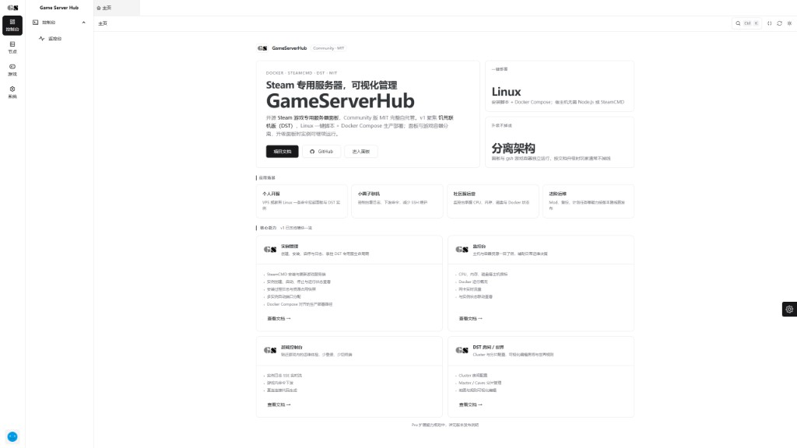

# Game Server Hub

[](LICENSE)
[](https://github.com/PMAT77/game-serve-hub/actions/workflows/ci.yml)


面向 Steam 专用服务器的开源运维面板。当前以《饥荒联机版》（DST）为首个完整适配游戏，提供安装、更新、启停、监控、日志、控制台、世界和 Mod 管理。



## 目录

- [适合谁](#适合谁)
- [它能做什么](#它能做什么)
- [视频教程](#视频教程)
- [快速开始](#快速开始)
- [开源与规划](#开源与规划)
- [常见问题](#常见问题)
- [交流与反馈](#交流与反馈)
- [文档](#文档)
- [参与贡献](#参与贡献)
- [赞助与商业合作](#赞助与商业合作)
- [许可证](#许可证)

## 适合谁

- **已经有一台服务器的服主** —— 云主机、家里的小主机都行：不必为开服换机器或买预装镜像，也不被某一家云厂商或面板服绑住；数据、存档和面板都在你自己的机器上。
- **个人服主** —— 不想再开一堆 SSH 窗口改 ini、手动重启世界；想在浏览器里管世界、Mod、玩家名单、存档与定时备份。
- **小团队 / 游戏社区** —— 需要多实例并存与操作可追溯；面板已内置账号认证与权限点，成员管理界面仍在开发中。
- **托管商 / 集成方** —— 多节点统一管理属于规划中的 Pro 插件；也可直接联系做定制集成（见文末）。

**不太适合的情况**：需要多用户权限隔离，或者要在 Windows 上开服 —— 这几类需求请优先考虑同类面板。

**正在开发中的功能**：

- **多用户与权限隔离**：后端已有账号与权限点，成员管理界面尚未提供，目前实际上只能单人使用。
- **操作审计日志**：查不到「谁在什么时候重启了世界」。
- **玩家事件统计**：聊天日志与在线时长统计仍在规划中（在线玩家列表、踢出与封禁已经可用）。
- **多语言界面、插件宿主**：均未提供。
- **按种子试算地形**：未提供，且**不在规划内**——DST 没有这种接口，地形只在游戏生成地图时才产生，唯一的办法是开服生成一次。作为替代，面板提供「**地形图**」：把**已经生成的世界**的地形导出成一张图（含当前 Mod 影响，不含玩家位置），带图例并标出猪王、洞穴入口、远古大门等关键地标，见 [DST 开服教程 · 地形图](docs/DST_TUTORIAL.md#126-地形图)。

另外三项属于产品边界，不在规划内：

- **Windows 部署**：本项目以 Linux 为目标平台，Windows 只用于本机开发调试，见[开发指南 · 平台定位](docs/DEVELOPMENT.md#平台定位)。
- **多层世界**：当前仅支持地上与洞穴双分片，暂不支持两个以上的分片。
- **多节点与多租户**：单节点架构，多节点管理属于规划中的 Pro 插件。

如果你需要多用户权限隔离，或者要在 Windows 上开服，**建议同时看看同类面板**，例如 [DMP 饥荒管理平台](https://github.com/miracleEverywhere/dst-management-platform-api) 或 [DST Admin Go](https://github.com/carrot-hu23/dst-admin-go)：它们的部署更简单、成员管理更完整；本项目更适合已经有一台服务器、不想被云厂商绑定、希望自行长期维护的场景。

## 它能做什么

- **一键开服与更新** —— 图形化创建实例，SteamCMD 自动安装与更新，地上 / 洞穴双分片一键拉起。
- **世界与 Mod 管理** —— 房间参数、世界生成配置、创意工坊 Mod 在线订阅与开关；**世界地形图**一键导出（读的是游戏自己算出来的地形）；存档点回档与重置世界前会自动创建安全备份。
- **玩家管理与准入** —— 独立的「玩家管理」页面：按游戏名维护管理员、白名单与黑名单（也支持粘贴玩家 ID），查看地上 / 洞穴的在线玩家并踢出或封禁；封禁立刻生效，房间重启后依然有效。
- **文件与配置** —— 在浏览器里浏览实例目录、直接编辑房间与世界配置文件、上传下载单个文件，保存或覆盖前自动备份；集群令牌等敏感文件不可读写。
- **实时掌控** —— CPU / 内存 / 磁盘 / 网络监控，SSE 实时日志，游戏控制台直接下发命令。
- **出问题能自查** —— 环境自检一键检查运行环境、磁盘余量、数据目录可写、实例状态与通知渠道；控制台日志落盘，可查看历史与下载。
- **存档与备份** —— 定时备份、面板数据库快照、导入既有存档。
- **两种部署方式** —— Docker Compose 或裸机 systemd，按你的隔离预期选。
- **升级安全** —— 同模式原地升级，升级前自动备份数据库，保留实例、存档和自定义配置。

## 视频教程

正在制作中：

发布后这里会替换为合集链接。在此之前，安装与排错请直接看[安装指南](docs/INSTALL.md)，开服操作看 [DST 开服教程](docs/DST_TUTORIAL.md)。

## 快速开始

当前为 `v0.9.0` 公测线。要求 Ubuntu 22.04 / 24.04 或 Debian 12，root/sudo，至少 4 GiB 内存和 4 GiB 空闲磁盘（离线镜像包约 227 MB，导入后本地镜像约 560 MB；游戏本体与存档另需数 GB）；Native 正式支持 x86_64，Docker 的 ARM64 支持仍为实验性。

> **4 GiB 内存的机器请先加 swap**：分片加载整套 Mod 时内存会短时冲高，4 GiB 物理内存同时承载主世界与洞穴会很紧张。执行 `sudo gsh setup-swap` 创建 2 GiB swapfile（同时设置 `vm.swappiness=20`）即可；启动前的内存守卫会按「分片数 ×（512 MiB + 每个 Mod 32 MiB）」估算并把可用 swap 计入余量，不够时直接拒绝启动并给出建议，而不是启动到一半被内核杀掉。

| 模式 | 适合谁 | 面板 | SteamCMD / 游戏进程 | 进程管理 |
| --- | --- | --- | --- | --- |
| Docker | 小型游戏社区、托管商 | Docker Compose | Docker | Docker Engine |
| Native | 个人服主 | 裸机 | 裸机 | 仅 systemd |

建议明确指定模式，避免自动判断与你的隔离预期不一致。Native 模式完全不依赖 Docker，也不使用 tmux、screen 或 PM2：面板由系统级 `game-server-hub.service` 管理，游戏分片由 `gsh` 用户的 systemd 服务管理。重启、自恢复、资源限制与开机自启都交给 systemd。**裸机模式属于首期预览能力，建议先在非关键服务器验证。**

> **平台支持**：两种模式都以 Linux 为目标平台。**Windows 不是部署目标，也不提供安装脚本**——它只用于本机开发调试，见[开发指南 · 平台定位](docs/DEVELOPMENT.md#平台定位)。

### Docker 模式

> **中国大陆服务器请先做这一步。** Docker 模式的安装器必须从 GHCR 拉取统一镜像，而 GHCR 的镜像层域名 `pkg-containers.githubusercontent.com` 在国内基本不可达 —— 直接执行下面的命令几乎必然卡在 `net/http: TLS handshake timeout`，重试无效。正确顺序是：先按[离线镜像包完整步骤](docs/INSTALL.md#路线-b国内服务器debian-12-离线镜像包全程)下载离线包并 `docker load` 导入，再执行下面的命令；镜像已在本地，安装器会自动跳过拉取。
>
> Native 模式不拉取任何容器镜像，不需要这一步。

```bash
curl -fsSL https://raw.githubusercontent.com/PMAT77/game-serve-hub/v0.9.0/scripts/install.linux.sh \
  | sudo bash -s -- --mode docker
```

### Native systemd 模式

```bash
curl -fsSL https://raw.githubusercontent.com/PMAT77/game-serve-hub/v0.9.0/scripts/install.linux.sh \
  | sudo bash -s -- --mode native
```

### 国内网络

国内的完整步骤按模式分成两条：Docker 走[离线镜像包完整步骤](docs/INSTALL.md#路线-b国内服务器debian-12-离线镜像包全程)，Native systemd 走[国内安装路线](docs/INSTALL.md#路线-dnative-国内服务器加速代理与国内档位)。

若 GitHub Raw 不稳定，可从 jsDelivr 获取同版本脚本，并启用国内网络档位（`--mode` 按你选的模式改）：

```bash
curl -fsSL https://cdn.jsdelivr.net/gh/PMAT77/game-serve-hub@v0.9.0/scripts/install.linux.sh \
  | sudo bash -s -- --mode native --network cn
```

`--network auto` 根据 GitHub、Docker 仓库和国内软件源的实际连通性选择档位，不使用 IP 归属接口；`cn` 会临时切换 Ubuntu/Debian 软件源、增加 SteamCMD 重试，失败时恢复原软件源。

安装完成后打开脚本输出的地址。初始密码默认不在摘要中明文展示，写在 `panel.env` 里，由面板启动时据此创建管理员（Docker 模式经 `docker-compose.yml` 注入容器，Native 模式经 systemd `EnvironmentFile` 注入进程）：

```bash
sudo sed -n 's/^ADMIN_PASSWORD=//p' /opt/game-server-hub/panel.env
```

Docker 部署若登录提示「账号或密码错误」，说明容器没收到这个变量（旧版 compose 或手动 `docker run` 未带 `-e`）：此时面板会自行生成随机密码并落盘，改读容器内的初始凭据即可：

```bash
docker exec game-server-hub-panel cat /app/data/admin-credentials.txt
```

首次登录必须修改密码（`FORCE_PASSWORD_CHANGE=1` 时面板会拦截至改密页，改密成功后上述凭据文件自动删除）。

> **卡在镜像下载**（`TLS handshake timeout`）说明跳过了上面的离线镜像包步骤：按同一链接完成 `docker load` 后重跑安装器即可。

镜像分发与代理、端口、升级、回滚和完整排错说明见 [安装与运维指南](docs/INSTALL.md)。

## 开源与规划

本项目采用 [MIT License](LICENSE)，**Community 核心功能永久开源免费，没有付费墙、没有功能阉割，也没有付费才可用的开关**。核心的安装、开服、房间与世界、Mod、玩家管理、备份与计划任务、通知与更新，都不需要授权文件。

对外只有两类与钱有关的安排，两件都不影响 Community 的使用：

1. **可选的付费服务**：代搭建、存档与面板迁移、私有化部署、批量部署与年度运维、定制开发（见文末[赞助与商业合作](#赞助与商业合作)）。
2. **规划中的 Pro 商业插件**：例如多节点管理、审计日志、异地备份。**目前仅在规划中、尚未开发，也没有时间表**，界面上没有任何 Pro 入口，遇到任何声称能解锁 Pro 的渠道请直接忽略。

两件事都在文末的[赞助与商业合作](#赞助与商业合作)一节里写明，含参考价格区间与不含项。

## 常见问题

### 下载脚本或安装资源失败

先改用上面的 jsDelivr 命令并指定 `--network cn`。安装器会依次尝试资源源，Compose 文件使用脚本内置 SHA256 校验，不会为了校验再次强制访问 GitHub Raw。

### Docker 安装失败

脚本会先尝试 Docker 官方仓库，再回退到发行版签名软件包。仍失败时检查 DNS、HTTPS 出站和 `/var/log/game-server-hub/install.diagnostics.log`。不会静默切换为 Native；确认需要裸机模式后显式重跑 `--mode native`。

### GHCR 镜像拉取失败

这是 Docker 模式在国内最常见的失败点。典型症状是**能列出镜像清单、但下载层时超时**（`pkg-containers.githubusercontent.com` 不可达，报 `net/http: TLS handshake timeout`）—— 这是网络不可达，不是鉴权问题，换代理或反复重试都不会成功。

**首选方案是离线镜像包**：每个 Release 都附带 `game-server-hub-<tag>-docker-image.tar.gz`。下载 → `sha256sum -c` 校验 → `docker load -i` 导入 → 再跑安装器（检测到本地已有镜像会跳过拉取）。完整命令见[离线镜像包完整步骤](docs/INSTALL.md#路线-b国内服务器debian-12-离线镜像包全程)。

其他备选路径：配置 HTTPS 代理；或把 `PANEL_IMAGE`、`GSH_GAME_DST_IMAGE`、`GSH_STEAMCMD_IMAGE` 指向你控制的可信仓库，并按 Release 的 `release-images.json` 核对 digest；或改用 `--mode native`。Native 模式不拉取任何容器镜像。

### Native 显示 systemd 不可用

执行：

```bash
sudo systemctl status game-server-hub.service --no-pager
sudo journalctl -u game-server-hub.service -n 100 --no-pager
sudo loginctl show-user gsh -p Linger
```

`Linger=yes` 且 `user@gsh-uid.service` 正常时，面板才能管理无人登录状态下的游戏用户服务。

### 玩家无法连接

同时检查本机防火墙和云厂商安全组。默认需放行面板 `9527/tcp`，以及 DST 的 `10999/udp`、`8766/udp`、`12346/udp`（开启洞穴还需 `11000`、`8768`、`12348`）。安装器只有在传入 `--open-panel-port` / `--open-dst-ports` 时才修改本机防火墙，后者覆盖主世界与洞穴共 6 个 UDP 端口。完整端口清单见 [DST 开服教程](docs/DST_TUTORIAL.md#4-开放端口安全组与防火墙)。

若宿主服务器位于 NAT 转发（云平台端口映射 / 路由器映射）之后，情况不同：6 个 UDP 各需一条转发规则，且外部端口必须与内部端口一致。详见 [DST 开服教程 5.4 节](docs/DST_TUTORIAL.md#54-宿主服务器在-nat-转发后面)。

先确认控制台显示的直连地址是否可用：地址来源见命令下方提示，来自"出站 IP 探测"的地址在本机 / 家用 NAT / 容器环境下往往不可直连（开着系统代理时还可能返回代理出口地址）；本机游玩请用「本机」档。Windows 环境的注意事项见 [DST 开服教程第 5 章](docs/DST_TUTORIAL.md#5-需要配置-ip-转发吗)。

### 重跑安装脚本会清空数据吗

不会。同模式重跑被视为原地升级：保留数据库、实例、备份、账号和自定义配置，备份 `panel.env` 后只更新版本相关键。Docker 与 Native 之间不自动迁移。

### 升级会不会弄丢存档

不会。同模式重跑安装脚本即为原地升级，升级前会自动备份面板数据库；实例目录、存档与备份目录不在升级的清理范围内。装之前仍然建议自己留一份存档副本，这也是「数据在你自己的机器上」的意义。

### 能从其他面板或裸机迁过来吗

能。面板的「备份与恢复 → 导入存档」支持整包导入，会自动重建 Mod 订阅并保留房间与世界配置。迁移最容易出问题的三处依次是：**端口内外必须一致**、**集群令牌是否仍然有效**、**Mod 是否全部下载完成**——迁完进不去服，先查这三项。手工整理旧机器的存档时，可以用仓库里的迁移导出工具生成可直接导入的包：

```bash
pnpm exec tsx scripts/export-cluster-archive.ts --source <旧机器的存档目录> --out <输出目录>
```

它会产出 `tar.gz`、校验和与一份迁移报告（分片端口、Mod 清单、名单、令牌状态与风险项）。需要人来做的话，见文末[赞助与商业合作](#赞助与商业合作)的迁移服务。

### 不想用了，数据能带走吗

能。面板本身不托管任何数据：存档是饥荒自己的 `klei-storage` 目录，备份是你机器上的 `tar.gz`，数据库是单个 SQLite 文件。卸载面板不会删除实例与备份目录；不装面板时，把存档目录交给官方专用服同样能开。

更多按错误关键词整理的处理方法见 [INSTALL.md 的 FAQ](docs/INSTALL.md#问题清单按报错关键词对照)。

## 交流与反馈


公测版本发布、部署安装问题、使用心得与建议都欢迎在群里讨论。

- **部署 / 配置 / 使用问题** → 群里问最快，也方便互相参考
- **可复现的 Bug、明确的功能请求** → 提 [Issue](https://github.com/PMAT77/game-serve-hub/issues)，不会被聊天记录冲掉，后续也好跟进

## 文档

服务范围与参考价格见上文[赞助与商业合作](#赞助与商业合作)一节。完整文档索引与阅读路径见 [docs/README.md](docs/README.md)。

**给服主**

| 文档 | 内容 |
| --- | --- |
| [安装与运维](docs/INSTALL.md) | 两种模式的选型、安装、升级、回滚、卸载、日志与按关键词排错 |
| [DST 开服教程](docs/DST_TUTORIAL.md) | 端口放行、面板操作、房间世界、控制台、玩家管理与在线玩家、备份与计划任务 |
| [内存建议](docs/MEMORY.md) | 4 / 6 / 8 GiB 档位、洞穴与 Mod 建议、`panel.env` 预设 |

**给开发者**

| 文档 | 内容 |
| --- | --- |
| [开发指南](docs/DEVELOPMENT.md) | 本地环境、代码地图、测试与构建 |
| [架构与产品边界](docs/ARCHITECTURE.md) | 运行时分层、Open-Core 边界与代码地图 |
| [发布流程](docs/RELEASE.md) | 版本策略与发布检查清单 |
| [镜像发布与副本校验](docs/IMAGE_DISTRIBUTION.md) | 统一镜像产物、digest 与离线镜像包 |

**其他**

| 文档 | 内容 |
| --- | --- |
| [术语表](docs/GLOSSARY.md) | 实例、分片、集群、统一镜像等名词解释 |
| [贡献流程](CONTRIBUTING.md) | Issue / PR 与提交规范 |
| [安全策略](SECURITY.md) | 漏洞报告方式与自托管安全实践 |
| [版本变更](CHANGELOG.md) | 每个版本的用户可见变更 |

## 参与贡献

欢迎提交 [Issue](https://github.com/PMAT77/game-serve-hub/issues) 与 [Pull Request](https://github.com/PMAT77/game-serve-hub/pulls)；流程与规范见 [CONTRIBUTING.md](CONTRIBUTING.md)，本地开发见 [开发指南](docs/DEVELOPMENT.md)，安全问题见 [SECURITY.md](SECURITY.md)。

后端基于 Fastify 与 Drizzle ORM，前端基于 Vue 3、Vite 与 Fantastic-admin。感谢这些项目及所有贡献者。

## 赞助与商业合作

项目主要利用业余时间维护。如果它帮你省下了时间，可以请我喝杯咖啡——赞助用于持续开发、测试机器与文档维护。


> 赞助是心意，不购买任何东西：它不等同于 Pro 授权、故障处理时限或一对一支持。

### 付费服务

Community 核心永久免费，下面的服务卖的是**人工与交付**，不是解锁功能。以下价格是参考区间，实际按机器环境与工作量确认后报价：

| 服务 | 交付物 | 参考价 |
| --- | --- | --- |
| **代搭建（单机）** | 面板安装 + 实例创建 + 开服验证 + 端口/安全组清单 + 交接说明 | 50～200 元/次 |
| **存档与面板迁移** | 从裸机或其他面板迁到本面板：存档、集群配置、Mod 清单与端口一一对应，迁完能进服 | 150～400 元/次 |
| **私有化部署** | 内网 / 代理受限 / 无公网环境的部署与反向代理，含离线镜像包与校验流程 | 600～2000 元/次 |
| **B 端标准化部署 / 维保** | 多台服务器统一部署规范、升级与回滚演练、季度检查报告 | 2000～5000 元/年 |
| **适配其他游戏** | 复用安装、分片、Mod 与控制台链路适配其他 Steam 专用服务器 | 按需求评估 |
| **功能定制开发** | 按你的玩法或运营需求实现专属功能，交付形式按需求商定 | 1500～10000 元/项目 |

**不含什么**（先说清楚，省得来回）：不做服务器采购与代付；不改动游戏本体；上游（Klei / Steam）接口变更导致的适配按新工作量另计。

**联系方式**

- 微信：`PMAT77`（下方二维码）
  - 添加时请**备注来意**，建议格式 `身份 / 需求 / 规模`，例如 `个人服主 / DST 开服 / 20 人`、`托管商 / 定制插件 / 多节点`
- 电话与合同细节在微信沟通后按需提供
- 功能问题与 Bug 见[交流与反馈](#交流与反馈)。项目由我利用业余时间维护、平日有主业在身，回复可能不够及时，但看到都会回


## 许可证

Community 源代码采用 [MIT License](LICENSE)：

```text
Copyright (c) 2026 Game Server Hub
SPDX-License-Identifier: MIT
```

**Game Server Hub** — 让开服像点一下那么简单。
