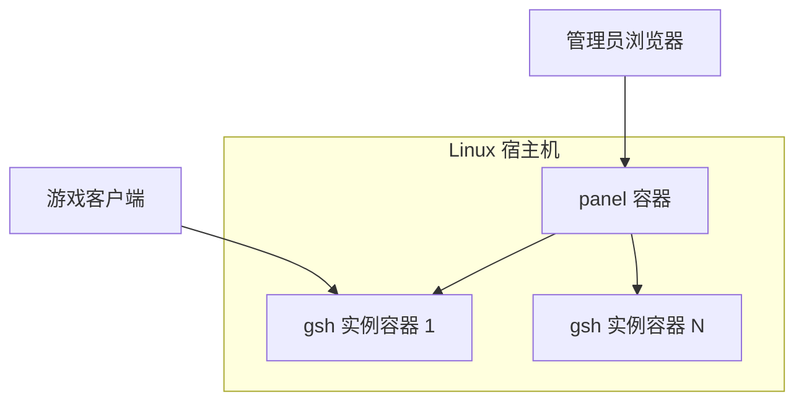

# Game Server Hub

[License: MIT](LICENSE)
[GitHub](https://github.com/GameServerHub/game-server-hub)
-orange)

开源 **Steam 专用服务器** 运维面板，把部署、运行和日常管理收进同一套界面。  
v1 先从 **饥荒联机版（Don't Starve Together）** 做起，支持一键开服。

> **当前版本：v0.x 公测（Pre-1.0 / Public Beta）** — 核心链路（安装、实例、DST 开服）可用；v1 完整能力仍在开发中，升级前请关注 [Release](https://github.com/GameServerHub/game-server-hub/releases) 说明。

## 界面预览


---

## 特性

- **一键部署**：Linux 安装脚本 + Docker Compose 全容器化运行时
- **实例生命周期**：创建实例、SteamCMD 安装/更新、启停、资源占用与安装日志
- **监控台**：主机 CPU / 内存 / 磁盘、Docker 概况、网卡实时流量
- **游戏控制台**：实例日志流（SSE）、游戏内命令下发
- **DST 房间 / 世界**：Cluster 与 Master/Caves 分片配置

---

## 架构概览



面板通过 Docker 管理游戏实例；升级面板镜像并重启 `panel` 时，可不停止 `gsh-*` 游戏容器（详见 [安装指南](docs/INSTALL.md)）。

---

## 快速开始

在 Ubuntu 22.04+ / Debian 12+ 上（需 root 或 sudo）：

```bash
curl -fsSL https://raw.githubusercontent.com/GameServerHub/game-server-hub/main/scripts/install.linux.sh | sudo bash
```

完整步骤、环境要求、升级与故障排查见 **[安装与运维指南](docs/INSTALL.md)**。

### 默认管理员账号（生产部署）


| 项   | 默认值          |
| --- | ------------ |
| 用户名 | `superadmin` |
| 密码  | `123456`     |


安装脚本会写入上述初始凭证（可通过环境变量 `ADMIN_USERNAME` / `ADMIN_PASSWORD` 覆盖）。**首次部署上线后务必立即修改密码**；默认启用 `FORCE_PASSWORD_CHANGE=1`，首次登录会提示改密。详见 [INSTALL.md](docs/INSTALL.md#默认管理员账号与安全)。

---

## 文档


| 文档                                         | 说明             |
| ------------------------------------------ | -------------- |
| [docs/README.md](docs/README.md)           | 公开文档索引         |
| [docs/INSTALL.md](docs/INSTALL.md)         | 生产安装、DST 使用、运维 |
| [docs/DEVELOPMENT.md](docs/DEVELOPMENT.md) | 本地开发、测试与贡献     |


---

## 功能模块

### 已实装（v1 核心 · 公测可用）

| 模块 | 说明 |
| --- | --- |
| 安装与部署 | Linux 一键安装、Docker Compose 全容器化、面板热升级 |
| 实例管理 | 创建实例、SteamCMD 安装/更新、启停、资源占用与安装日志 |
| 监控台 | 主机 CPU / 内存 / 磁盘、Docker 概况、网卡实时流量 |
| DST 房间 | Cluster 配置与可视化管理 |
| DST 世界 | Master / Caves 分片与世界生成规则配置 |
| 实例控制台 | 日志流（SSE）、游戏内命令下发、连接信息 |
| 系统与认证 | 管理员账号、首次改密与基础系统设置 |

### 即将上线

v1 仍在补齐以下能力，将按规划陆续发布：

- **Mod 管理**：订阅 Mod 列表、依赖提示与启停
- **游戏大厅与玩家**：大厅展示配置、访问名单与在线玩家视图
- **存档备份**：手动备份与一键恢复
- **运维工具**：文件管理、配置中心、维护公告推送、通知与操作审计等 

---

## 当前支持与路线图

| 游戏 | 状态 |
| --- | --- |
| 饥荒联机版（DST） | **核心能力可用（公测）** |
| 其他 Steam 专用服 | 计划中 |

---

## Community 与 Pro

- **Community**：本仓库 MIT 开源，提供自托管核心能力（见上文「已实装」模块）。
- **Pro**：商业扩展（多集群、计划任务、高级运维等）通过独立授权与扩展包提供；**含多集群能力的 Pro 版正在推进中**，详情敬请期待。

---

## 参与贡献

欢迎 [Issue](https://github.com/GameServerHub/game-server-hub/issues) 与 [Pull Request](https://github.com/GameServerHub/game-server-hub/pulls)。开发环境搭建与提交规范见 **[开发指南](docs/DEVELOPMENT.md)**。

---

## 技术栈与致谢

前端管理界面基于 [Fantastic-admin](https://fantastic-admin.hurui.me) 构建，使用 [Vue 3](https://vuejs.org/)、[Vite](https://vite.dev/) 等开源技术。
后端采用 [Fastify](https://fastify.dev/) 与 [Drizzle ORM](https://orm.drizzle.team/)。
感谢上述项目及社区贡献者。

---

## 赞助

平时在业余时间维护这个项目。若你觉得好用、想支持一下，欢迎随缘赞助，主要用于挤出点时间继续开发和补文档。


<br>
> 非 Pro 或一对一技术支持；商业合作欢迎开 Issue 聊。

---

## 许可证

本仓库 **Community 版** 源代码采用 **[MIT License](LICENSE)** 发布。

```text
Copyright (c) 2026 Game Server Hub
SPDX-License-Identifier: MIT
```

---

## 商业合作
Game Server Hub 采用 Open Core 模式：Community 可自由自托管；Pro 能力与官方云集成通过商业授权提供。
云服务器厂商、托管服务商合作欢迎 [联系我们](https://github.com/GameServerHub/game-server-hub/issues/new?title=%5B商业合作%5D)。
在产品名称或宣传中使用 Game Server Hub 商标与 Logo 需事先授权。

**Game Server Hub** — 让开服像点一下那么简单。