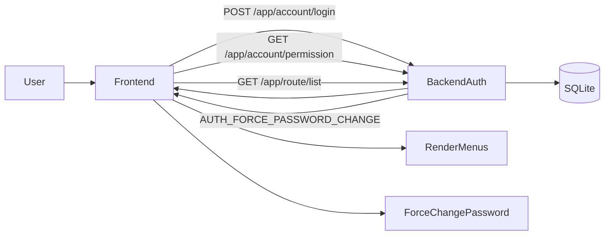
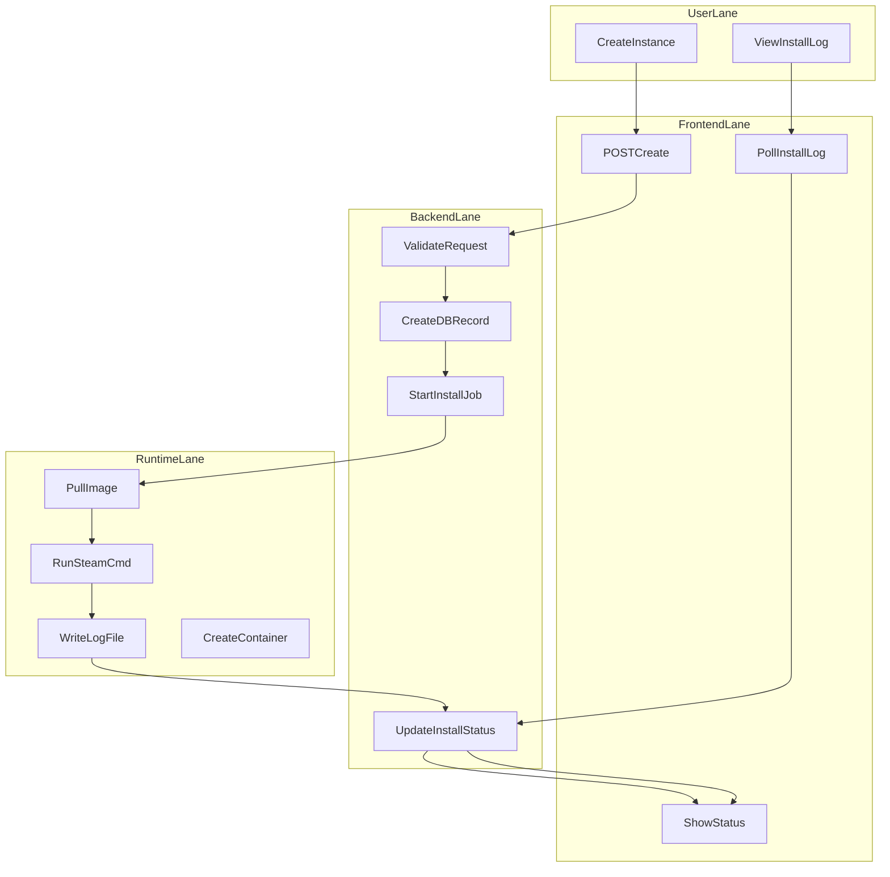
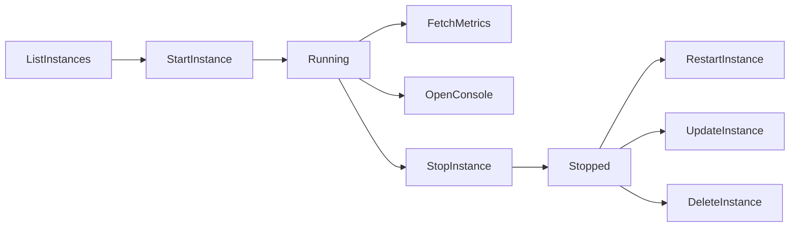
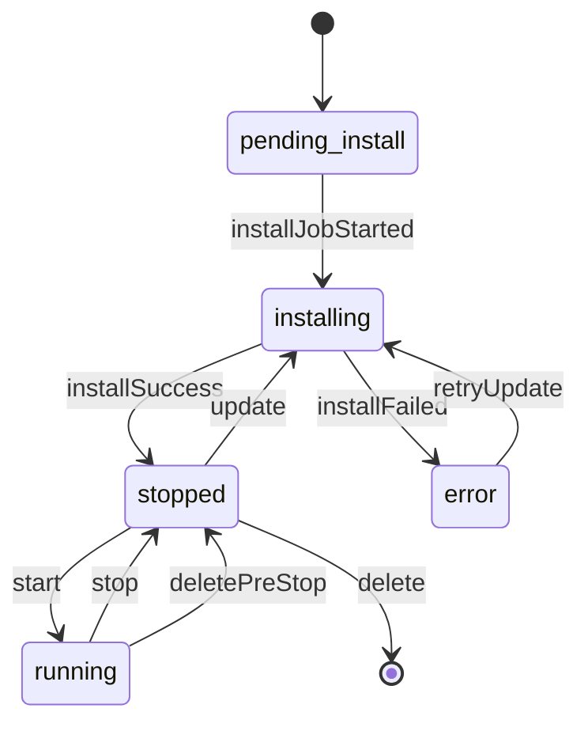
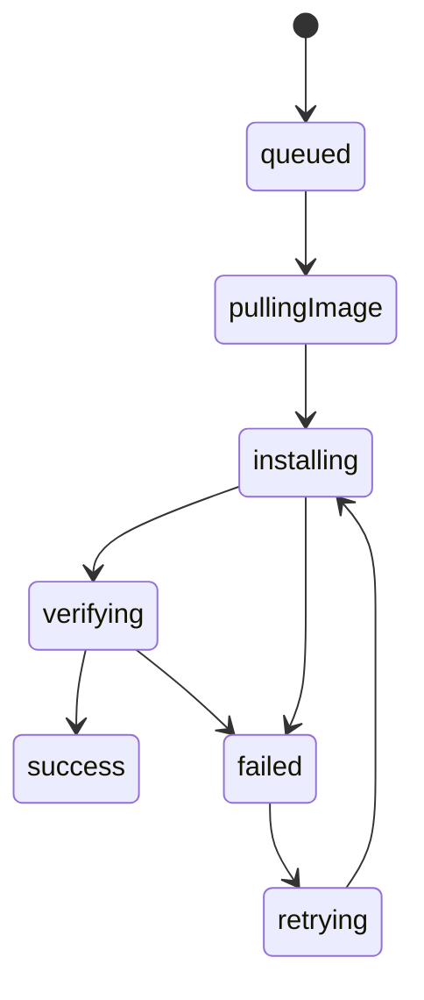
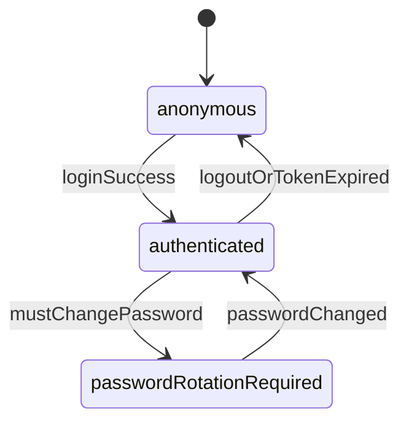

# 业务流程图与状态机图

## 1. 文档说明

- 本文提供核心业务流程泳道图与关键实体状态机。
- 图示覆盖主路径、分支路径与异常路径。

## 2. 核心业务泳道图

### 2.1 登录鉴权与路由加载

### 2.2 实例创建与安装（泳道）

### 2.3 实例运行维护主流程

## 3. 关键实体状态流转图

### 3.1 游戏实例状态机

### 3.2 安装任务状态机

### 3.3 认证会话状态机

## 4. 分支流程与异常流程

### 4.1 分支流程

- **创建实例前置检查失败**：名称重复、参数不合法、运行时不可用 -> 阻断创建。
- **更新检测流程**：检测到远端版本差异 -> 标记可更新；无差异 -> 返回已最新。
- **控制台读取流程**：优先流式推送，回退轮询拉取。

### 4.2 异常流程

- **Docker 连接失败**：系统模块返回错误，实例操作禁止继续。
- **安装中断**：状态转为错误态并记录日志，支持再次触发更新/重装。
- **网络配置应用失败**：保留原配置，返回校验失败原因。

## 5. 与文档映射

- 需求总览：`docs/03-PRS.md`
- 架构支撑：`docs/05-SYSTEM-ARCHITECTURE-DESIGN.md`
- 模块细化：`docs/FDS/*`
