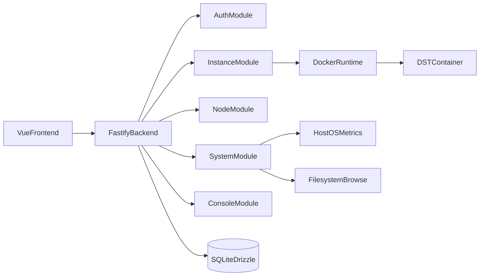
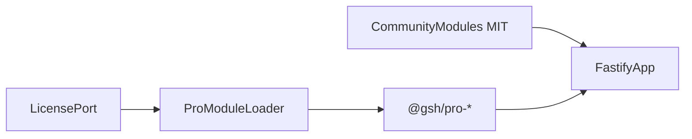

# 系统架构设计文档

## 1. 整体架构图

## 2. 模块划分与职责定义

### 2.1 前端层

- 路由模式：后端动态路由为主，固定路由为辅。
- 页面模块：监控台、实例管理、实例控制台、DST 房间/世界（`games/dst/*`）、系统设置。
- API 层：按领域拆分模块（`app/node/instance/system`）。

### 2.2 后端层

- `auth`：认证、会话、权限与动态路由输出。
- `system`：系统设置、SteamCMD 配置、系统资源与网络数据。
- `node`：本地节点注册与节点列表。
- `instance`：实例生命周期、安装任务、更新检测、实例指标。
- `cluster` / `shard`：DST 房间（`cluster.ini`）与世界分片（Master/Caves）配置（FDS-03/04）。
- `console`：实例日志、命令、SSE 实时流。

### 2.3 基础设施层

- `container runtime`：Docker 连接、镜像拉取、容器生命周期。
- `game adapter (dst)`：DST 目录、配置与运行时规范封装。
- `filesystem`：受控目录浏览与查询。

### 2.4 数据层

- SQLite + Drizzle ORM。
- 主实体：`users`、`auth_sessions`、`server_nodes`、`game_instances`、`system_settings`。
- 预留实体：`instance_mods`、`backups`。

## 3. 模块间交互关系与数据流

### 3.1 主数据流

1. 用户在前端触发操作。
2. API 请求进入后端模块并完成鉴权。
3. 业务模块读写 SQLite 持久化状态。
4. 涉及实例操作时调用 Docker Runtime。
5. 结果通过统一响应壳返回前端并渲染。

### 3.2 关键交互链路

- 登录链路：`frontend -> auth -> db -> frontend`。
- 创建实例链路：`frontend -> instance -> adapter/runtime -> db/log -> frontend`。
- 监控链路：`frontend -> system|instance -> metrics collector -> frontend`。

## 4. 关键技术决策与理由

- **单体后端（Fastify）**：v1 快速迭代、降低部署与协作复杂度。
- **SQLite（Drizzle）**：轻量部署、结构清晰、适合单节点起步。
- **Docker 运行时优先**：隔离进程环境、统一安装与运行流程。
- **适配器化目录**：为后续多游戏接入保留边界。
- **动态路由后端驱动**：菜单权限与能力边界集中管理。

## 5. 非功能需求实现方案

### 5.1 性能

- 指标采样与短缓存减少高频采集开销。
- 列表与状态接口以轻量响应为主。

### 5.2 安全

- 会话鉴权 + 强制改密机制。
- 文件系统浏览限制路径范围。
- 错误码统一，避免泄露内部细节。

### 5.3 可用性

- 安装日志可追溯，关键操作有状态反馈。
- 服务健康检查接口支持运行态探活。

### 5.4 可扩展

- 模块化注册与路由拆分支持增量能力接入。
- game adapter 为多游戏扩展预留。
- 文档化 FDS 与 TODO 支撑按模块演进。

## 6. 当前架构限制

- v1 仅 DST 单游戏与本地节点核心路径；**模块 03/04**（房间与世界）Community 闭环已验收，详见 `TODO.md` §7 与 FDS-03/04。
- 计划任务、通知审计等仍在规划态；模块 11 为 Pro-only。
- 细粒度 API 授权与企业级审计链路尚未完成。

## 7. Open Core 分层（Community / Pro）

Game Server Hub 采用 **Open Core** 架构：Community 代码 MIT 公开；Pro 能力以私有 npm 包（`@gsh/pro-*`）注入同一 Fastify 运行时，用户升级无需重装实例数据。

要点：

- 模块注册入口：[`server/src/app.ts`](../server/src/app.ts)（Community）；Pro 包在 License 有效时动态加载。
- 前端动态路由：auth 模块 `/app/route/list`；Pro 包追加路由或 Community 提供升级引导。
- 功能边界与开发约束：[`13-PRO-OPEN-CORE-ARCHITECTURE.md`](./13-PRO-OPEN-CORE-ARCHITECTURE.md)、[`TODO.md`](./TODO.md) §5、[`COMMERCIAL.md`](./COMMERCIAL.md)。

M3-b 起在 Community 仓实现 `LicensePort` / `ProModuleLoader` stub；M3-c 起首个 Pro 包 `@gsh/pro-scheduler`。