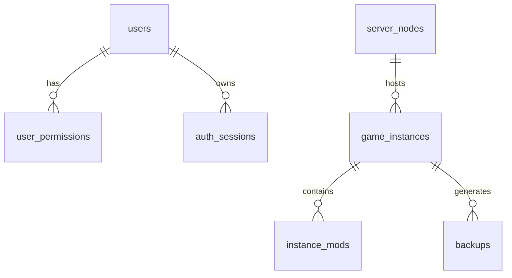

# 数据库设计文档

## 1. 数据库选型

- **引擎**：SQLite（文件型数据库）
- **ORM**：Drizzle ORM
- **选型理由**：
  - 部署轻量，适配单节点自托管场景。
  - 与当前单体后端结构匹配，迁移成本低。
  - 开发与调试效率高，支持快速迭代。

## 2. 表结构定义（当前实现）

### 2.1 认证与用户域

#### `users`
- 主键：`id`
- 关键字段：`account`、`password_hash`、`must_change_password`、`status`
- 用途：用户主档与认证状态

#### `user_permissions`
- 复合主键：`user_id + permission`
- 用途：用户权限码集合

#### `auth_sessions`
- 主键：`token`
- 关键字段：`user_id`、`last_seen_at`、`revoked_at`
- 用途：会话令牌与在线状态

### 2.2 节点与实例域

#### `server_nodes`
- 主键：`id`
- 关键字段：`host`、`ssh_port`、`status`、`cpu_usage`、`memory_usage`、`disk_usage`
- 用途：节点注册与资源快照

#### `game_instances`
- 主键：`id`
- 关键字段：
  - 基础：`node_id`、`name`、`game_code`、`status`
  - 运行态：`container_id`、`runtime_pid`、`runtime_started_at`
  - 安装态：`install_log_status`、`install_percent`
  - 更新态：`update_available`、`local_build_id`、`remote_build_id`
- 用途：实例生命周期核心状态

### 2.3 系统配置域

#### `system_settings`
- 主键：`key`
- 关键字段：`value`、`updated_at`
- 用途：面板、网络、SteamCMD 等配置存储

### 2.4 规划预留域

#### `instance_mods`
- 用途：实例 Mod 清单与启用状态
- 状态：表结构已存在，业务模块规划态

#### `backups`
- 用途：备份元数据
- 状态：表结构已存在，业务模块规划态

## 3. 表关系设计

说明：当前为应用层关系约束，未全面启用数据库外键约束。

## 4. 索引与查询策略

- 主键与唯一约束覆盖核心定位字段（`users.account`、`auth_sessions.token`）。
- 实例列表依赖 `game_instances` 常用状态字段检索。
- 高频查询建议后续补充复合索引（如 `node_id + status`）。

## 5. 迁移策略

- 使用 Drizzle 迁移脚本维护 schema 变更。
- 运行时对少量兼容字段采用兜底补列策略。
- 变更原则：先迁移后代码依赖，避免线上字段缺失。

## 6. 分库分表策略

### 6.1 当前策略

- v1 不做分库分表，采用单库文件管理。

### 6.2 未来扩展建议

- 多节点规模提升后，可按“租户/节点”做逻辑分片。
- 审计与日志可独立到时序或列式存储。
- 当并发写入与历史数据量上升时，评估迁移到 PostgreSQL。

## 7. 数据安全与备份

- 敏感信息（密码）仅存储哈希值。
- 建议周期化导出 SQLite 文件与关键配置目录。
- 后续模块 06 将纳入一键备份与恢复流程。
