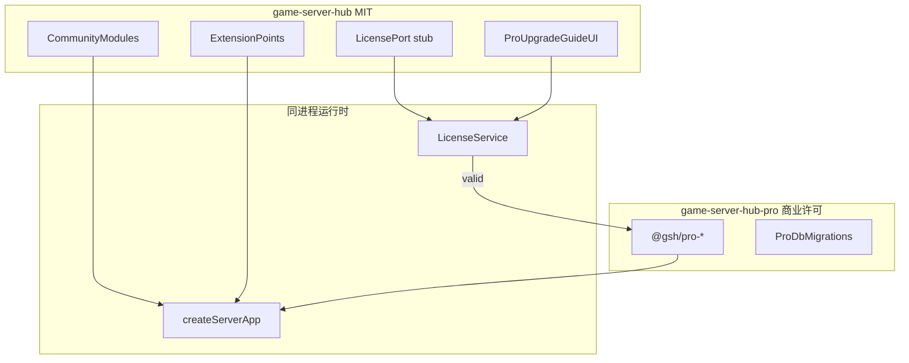

# Open Core 架构（Community / Pro 分层）

> 最后更新：2026-05-21  
> 状态：已采纳（C 方案）  
> 关联文档：[COMMERCIAL.md](./COMMERCIAL.md)、[TODO.md](./TODO.md) §5、[MODULE-KICKOFF.md](./MODULE-KICKOFF.md)

## 1. 概述

Game Server Hub 采用 **Open Core** 商业化架构：

- **Community**：公开 MIT 仓库，完整自托管核心能力。
- **Pro**：私有仓库 / 商业许可 npm 包（`@gsh/pro-*`），通过扩展点注入同一运行时。
- **升级**：换 Pro 镜像或安装 Pro 包 + 激活 License + 重启；**不重装、不迁移实例数据**。

本文档为 Community / Pro 分层的**唯一技术权威**。功能边界对照表见 [TODO.md §5](./TODO.md#5-community--pro-功能对照表) 与 [COMMERCIAL.md](./COMMERCIAL.md)。

## 2. 总体架构



## 3. 仓库与发行物

| 产物 | 许可证 | 内容 |
|------|--------|------|
| `game-server-hub`（本公开仓） | MIT | Community 全量、扩展点接口（stub）、Pro 升级引导页 |
| `game-server-hub-pro`（私有仓，名称以 COMMERCIAL 为准） | 商业 | `@gsh/pro-scheduler`、`@gsh/pro-audit` 等按模块分包 |
| Docker 镜像 `gsh/community` | MIT 层 | 不含 Pro 字节码 |
| Docker 镜像 `gsh/pro` | 商业 | Community 层 + 预装 Pro 包 |

**硬约束**：Pro 业务实现**不得** merge 进 MIT 公开分支。Community 发行物中不得包含可运行的 Pro 模块代码。

## 4. 分层类型

| 类型 | 含义 | Community 仓 | Pro 私有包 |
|------|------|--------------|------------|
| **community-only** | 仅 MIT 实现 | 完整实现 | 无 |
| **pro-only** | 整模块 Pro | 升级引导 + 扩展点 stub | 完整实现 |
| **hybrid** | 基础 Community + 增强 Pro | 基础能力 MIT | 增强能力专有 |

模块级对照见 [TODO.md §5](./TODO.md#5-community--pro-功能对照表)。

## 5. 运行时扩展点

对齐现有 [`server/src/app.ts`](../server/src/app.ts) 模块注册模式。M3-b 里程碑起在 Community 仓实现接口 stub；M3-c 起在私有仓实现 Pro 包。

### 5.1 概念 API

```typescript
/** Pro 模块注册器（私有包实现） */
interface ProModuleRegistrar {
  register(app: FastifyInstance, ctx: ProRuntimeContext): Promise<void>
}

/** 许可证端口（Community 仓定义接口，M3-b 起 stub 实现） */
interface LicensePort {
  getEdition(): 'community' | 'pro'
  getEntitlements(): string[]
  isValid(): boolean
}

interface ProRuntimeContext {
  edition: 'community' | 'pro'
  entitlements: string[]
  db: DrizzleDb
}
```

### 5.2 后端启动顺序

1. `registerCommunityModules(app)` — 现有 auth/system/node/instance/cluster/shard/console 等。
2. `licenseService.load()` — 读取 License 文件或环境变量；未激活时 edition = `community`。
3. `loadProModules(app)` — 若 Pro 包存在于 node_modules（Pro 镜像或私有源），且 License 有效，则动态 `import('@gsh/pro-*')` 并调用 `register()`。
4. 暴露 `GET /api/meta/edition` — 返回 edition 与 entitlements（M3-b）。

### 5.3 前端路由

- 沿用 auth 动态路由（[`server/src/modules/auth/index.ts`](../server/src/modules/auth/index.ts) `/app/route/list`）。
- **Pro 包**：通过 `registerProRoutes()` 向 `/app/route/list` 或等价扩展点追加路由（M3-c 设计细节在 Pro 仓文档）。
- **Pro-only 模块**（如模块 11）：Community 仅注册「计划任务 → 升级 Pro」占位菜单，链至 `/system/license` 或等价升级页。
- **Hybrid 模块**：Community 实现基础页面；Pro 能力在 UI 显示「升级 Pro」，**不在 MIT 仓内实现灰态 Pro 控件**。

### 5.4 数据库迁移

- **Community**：migration 位于公开仓 `server/drizzle/`。
- **Pro**：表/字段 migration 随 `@gsh/pro-*` 包发布；License 激活后、Pro 模块加载前执行。
- Community 与 Pro migration **分目录管理**，禁止在 MIT 仓提交 Pro 表结构。

### 5.5 授权校验

- Pro API 路由必须在 Pro 包内注册，并挂载 **entitlement middleware**（服务端校验，非仅前端 guard）。
- 支持**离线宽限期**（默认 30 天，参数见 [COMMERCIAL.md](./COMMERCIAL.md)）；宽限期外 Pro 模块不加载，Community 能力不受影响。

## 6. 用户升级路径（无重装）

1. 将 Docker 镜像从 `gsh/community` 换为 `gsh/pro`，或从私有 registry 安装 `@gsh/pro-*`。
2. 在面板「许可证」页填写 License Key。
3. 重启 Hub 服务。
4. 自动执行 Pro DB migration → 动态注入 Pro 路由/API/菜单。
5. **实例、SQLite、Docker 卷、DST 配置（cluster.ini / leveldata）保持不变**。

## 7. 新模块开发约束

开工任一涉及 Pro 的模块前，对应 FDS **必须**新增 **「Open Core 落点」** 小节，包含：

| 字段 | 说明 |
|------|------|
| edition 类型 | `community-only` / `hybrid` / `pro-only` |
| Community 实现边界 | 公开仓路径，如 `server/src/modules/backup/` |
| Pro 包名 | 如 `@gsh/pro-scheduler` |
| 扩展点 ID | Hybrid 时 Community 暴露的 hook（事件、接口、路由槽位） |
| entitlement 键 | 如 `scheduler`、`multinode`、`cloud_backup` |
| 禁止事项 | Pro 业务逻辑不得 merge 进 MIT 公开分支 |

### 7.1 community-only

- 全部实现在 MIT 公开仓。
- FDS 标注 `Community-only`，无需 Pro 包名。

### 7.2 hybrid

Community 侧最低交付：

- 稳定扩展点（事件 emit / 端口 interface），供 Pro 包订阅或扩展。
- Community API **不返回** Pro 字段的占位假数据。
- UI 对 Pro 能力显示「升级 Pro」，而非灰掉不可用控件。

Pro 侧：

- 增强逻辑仅在 `@gsh/pro-*` 私有包。
- 通过 entitlement 键控制 API 与路由注册。

### 7.3 pro-only

Community 侧最低交付：

- 菜单占位 + 升级引导页（链至 `/system/license`）。
- `LicensePort.getEdition()` 为 `community` 时不暴露 Pro API。

Pro 侧：

- 模块 CRUD、调度引擎、业务 UI 等**全部**在私有包。
- 示例：模块 11 计划任务 → `@gsh/pro-scheduler`。

## 8. Entitlement 键命名规范

- 小写 snake_case：`scheduler`、`cloud_backup`、`multinode`、`external_notify`。
- 与 Pro 包名不必一一对应；一个包可注册多个 entitlement。
- 新增 entitlement 须同步更新 [TODO.md §5](./TODO.md#5-community--pro-功能对照表) 与 [COMMERCIAL.md](./COMMERCIAL.md)。

## 9. 里程碑（实现顺序）

| 阶段 | 内容 | 依赖 |
|------|------|------|
| M3-a 文档与规范 | 本文档、COMMERCIAL、FDS/TODO/MODULE-KICKOFF 同步 | 可与 M2 并行 |
| M3-b 扩展点 stub | `LicensePort`、`ProModuleLoader` 接口 + no-op；`/api/meta/edition` | M3-a |
| M3-c 首个 Pro 包 | 私有仓 `@gsh/pro-scheduler`；Pro 镜像 POC | M3-b |
| M3-d 授权与升级 UX | License 激活页、离线宽限、Pro migration 流水线 | M3-c |
| M4 Pro 模块扩展 | `@gsh/pro-audit`、多节点、云备份等按对照表逐个落地 | M3-d |

## 10. 参考实现落点（规划）

| 能力 | Community 仓路径（规划） | Pro 包 |
|------|--------------------------|--------|
| License stub | `server/src/shared/license/` | `@gsh/pro-core` |
| Pro 模块加载 | `server/src/bootstrap/load-pro-modules.ts` | 各 `@gsh/pro-*` |
| 升级引导 UI | `src/views/system/license.vue` | — |
| 计划任务 | 占位菜单 only | `@gsh/pro-scheduler` |

## 11. 维护规则

- 功能边界变更须同步：`13-PRO-OPEN-CORE-ARCHITECTURE.md` + `TODO.md` §5 + `COMMERCIAL.md` + 受影响 FDS「Open Core 落点」。
- Agent / 开发者写 Pro 相关代码前须阅读本文档与 `.cursor/rules/pro-open-core.mdc`（若存在）。
