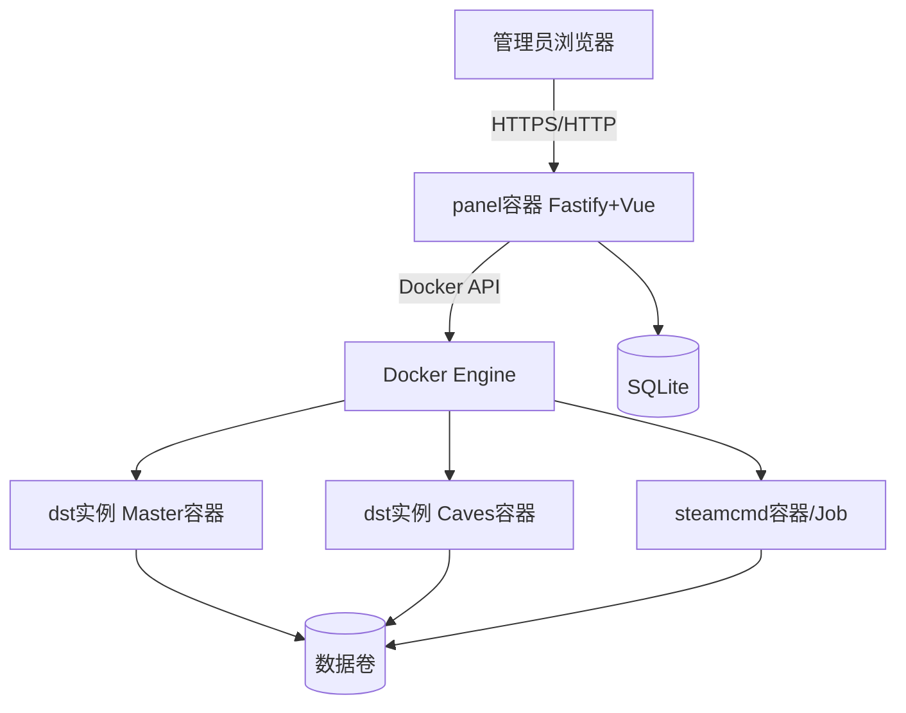

# GameServerHub 技术架构

> 描述 v1 **目标架构**与当前过渡态差距。决策依据见 [adr/](adr/)。  
> 最后更新：2026-05-18

## 1. 系统上下文



- **用户**仅访问面板 Web/API，不直接 SSH 操作游戏（高级用户可用文件管理或 SSH 作为补充）。
- **面板**为控制面；**游戏**为数据面容器。

## 2. 仓库分层

遵循 [PROJECT_BASELINE.md](PROJECT_BASELINE.md)：

| 层级 | 路径 | 职责 |
|------|------|------|
| 前端 | `src/` | Vue 3 页面、`api/` 请求封装 |
| 后端模块 | `server/src/modules/*` | 业务路由注册入口 |
| 共享契约 | `shared/` | 错误码、API 类型 |
| 基础设施 | `server/src/infra/*`（规划） | Docker、SteamCMD、游戏适配器 |
| 共享运行时 | `server/src/shared/*` | DB、配置、HTTP、实例注册表（过渡） |

### 2.1 已注册模块

`auth` · `system` · `node` · `instance` · `console`

### 2.2 占位模块

`mod` · `config` · `backup` · `file` — 实现前须先有对应 [FDS](FDS/README.md)。

## 3. 部署拓扑（v1 目标）

### 3.1 Compose 服务（规划）

| 服务名 | 镜像 | 说明 |
|--------|------|------|
| `panel` | `ghcr.io/.../game-server-hub` | 面板，挂载 docker.sock、数据目录 |
| `steamcmd` | 官方或自建 steamcmd | 供安装/更新任务调用 |
| `game-{instanceId}-master` | `game-dst` 基底 | 动态创建，非静态 compose 成员时可由面板 `docker run` |
| `game-{instanceId}-caves` | 同上 | 可选 |

**卷（示例）**：

| 卷 | 挂载 | 内容 |
|----|------|------|
| `gsh-data` | `/app/data` | SQLite、面板配置 |
| `gsh-instances` | `/var/lib/game-server-hub/instances` | 各实例 `installPath` |
| `gsh-backups` | `/var/lib/game-server-hub/backups` | 备份归档 |

### 3.2 网络

- 面板对外暴露 `PANEL_PORT`（默认 80→3000）。
- 游戏端口映射到宿主机：`game_port` 及洞穴端口由实例配置决定。
- 开发/生产推荐 **bridge + 明确端口映射**；若遇 Steam 注册问题再评估 `host` 网络（见 ADR-001 风险）。

### 3.3 面板访问 Docker

- 挂载 `/var/run/docker.sock`（或 rootless socket）。
- 安全：面板进程非 root、只读挂载评估、禁止任意 `docker run` 参数由用户输入拼接。

## 4. 运行时抽象（代码已落地，Compose 验收待场景 C）

### 4.1 `ContainerRuntime`（`server/src/infra/container/`）

```typescript
interface ContainerRuntime {
  createShardContainer(spec: ShardContainerSpec): Promise<ContainerRef>
  start(ref: ContainerRef): Promise<void>
  stop(ref: ContainerRef, timeoutSec?: number): Promise<void>
  remove(ref: ContainerRef): Promise<void>
  logs(ref: ContainerRef, opts: LogOpts): AsyncIterable<LogLine>
  exec(ref: ContainerRef, cmd: string[]): Promise<ExecResult>
  inspect(ref: ContainerRef): Promise<ContainerInspect>
}
```

`instance` 模块启停/删除已接上述接口（`container-lifecycle.ts`），**须在 panel 容器 + Compose 栈下回归**（场景 C）；`runtime_pid` 字段保留兼容，目标态以 `container_id` 为准。

### 4.2 与控制台的关系

| 能力 | 过渡态 | 目标态 |
|------|--------|--------|
| 日志 | `instanceRuntimeRegistry` 内存 + 子进程 stdout | Docker logs 流 + SSE 转发 |
| 命令 | stdin 管道 | `docker exec` 进容器控制台 |

见 [FDS-09](FDS/09-console.md)。

### 4.3 SteamCMD 安装任务

- 由面板调度 `steamcmd` 容器执行 `app_update 343050`，输出写安装日志文件（已有 `data/install-logs/` 思路）。
- 安装完成后在实例卷上生成/更新 DST 文件与 [DOMAIN.md](DOMAIN.md) 目录结构。

## 5. 游戏适配器

```text
server/src/infra/game-adapter/
  ├── types.ts          # GameAdapter 接口
  ├── registry.ts       # gameCode → adapter
  └── dst/              # 343050 实现
```

适配器职责：安装参数、Cluster/Shard 初始化、启动 spec、Mod 路径、备份路径。详见 [FDS-14](FDS/14-game-adapter.md)。

## 6. 认证与安全

- 单管理员账号（SQLite `users`）；Token 请求头 `token`。
- `FORCE_PASSWORD_CHANGE=1` 时拦截除白名单外的 `/app/*`。
- 路径校验：实例 `install_path` 禁止 `..` 与系统敏感目录（已有 `validateInstallPath`）。
- 控制台命令：运行中才可发；规划白名单快捷命令（DST Lua）。

## 7. 可观测性

| 类型 | 实现 |
|------|------|
| 请求日志 | Fastify `requestId`、访问日志 |
| 主机监控 | `/app/system/info`、`/app/system/network/realtime` |
| 实例指标 | `POST /app/instance/metrics`（CPU/内存，过渡态基于 PID） |
| 安装日志 | 文件 + `GET /app/instance/install-log` |

M0 后实例指标改为 cgroup / Docker stats。

## 8. 当前实现 vs 目标（差距清单）

| 项 | 当前 | 目标 |
|----|------|------|
| 面板运行 | 安装脚本 + Compose panel；开发可用 `dev:compose` | 与目标一致 |
| 游戏运行 | 代码已接容器 API；**Compose 下未验收** | 容器 + `container_id`，场景 C 通过 |
| DST 洞穴 | 仅 Master 容器 | Master + Caves 容器（模块 4） |
| 控制台日志/命令 | 部分过渡态 | Docker logs + exec（模块 9） |
| 实例指标 | 混合 PID / 容器 stats | 全面 Docker stats |

## 9. 相关文档

- [adr/001-full-containerization.md](adr/001-full-containerization.md)  
- [API.md](API.md)  
- [RUNBOOK.md](RUNBOOK.md)  
- [FDS-00-install-runtime.md](FDS/00-install-runtime.md)  

---

*架构变更须新增或更新 ADR。*
