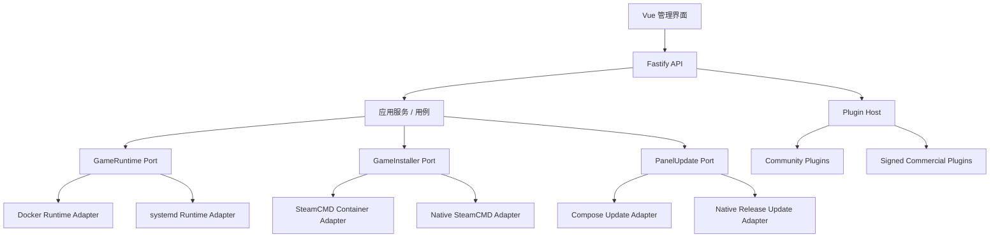

# Game Server Hub 架构与产品边界

本文记录 Game Server Hub 从 Docker-only 面板演进为双部署、Open-Core 产品的稳定边界。实现和评审若与本文冲突，应先更新本文并说明迁移策略。

## 产品定位

| 部署模式 | 主要用户 | 面板运行方式 | SteamCMD / 游戏运行方式 |
| --- | --- | --- | --- |
| Docker | 小型游戏社区、游戏托管商 | Docker Compose | Docker 容器 |
| Native | 个人服主 | systemd 系统服务 | systemd 用户服务 |

Native 模式必须完全不依赖 Docker。它不是“面板运行在宿主机、游戏仍运行在容器”的混合模式。

首期正式支持 Ubuntu 22.04 / 24.04、Debian 12 和 x86_64。ARM64 仅作为实验性平台展示；具体游戏是否可运行取决于 SteamCMD 与游戏服务端本身。

## Open-Core 边界

Community 核心永久开源，至少包含：

- 单节点管理
- Docker / Native 双部署
- 游戏安装、更新、启动、停止和控制台
- 基础主机与实例监控
- DST 房间、世界、Mod 管理
- 本地备份与恢复
- 公开的插件 SDK、插件清单格式和兼容性检查

商业插件可以包含：

- 多节点与集群管理
- 计划任务
- 异地或云备份
- 告警通知
- 审计日志和高级 RBAC
- SSO、托管商和白标能力

首个商业插件是多节点管理。Community 核心不能因为商业插件缺失而失去单机服务器的完整生命周期管理能力。

商业插件使用签名插件包和设备授权文件。授权文件允许离线使用；授权服务不可达时，不得立即停止正在运行的游戏实例。

> 实现状态：本轮先交付双运行时、安装器和 Release 基础设施。插件宿主、签名插件包与设备授权文件是后续里程碑；当前 Community 版本没有付费插件占位实现。

## 分层架构



业务模块不得直接导入 `dockerode`、执行 `docker` 命令或拼接 systemd 单元。基础设施细节只能存在于对应 Adapter 内。

### 运行时能力

通用运行时使用“服务/进程”语义，而不是“容器”语义：

- 运行时可用性检查
- 创建或更新实例服务
- 启动、停止和删除
- 查询状态、PID、CPU、内存和启动时间
- 读取和持续跟随日志
- 向游戏控制台写入命令
- 为多分片实例准备和清理互联配置

Docker Adapter 可以继续用容器 ID 作为运行时引用；Native Adapter 使用 systemd unit 名称。数据库迁移期间保留现有 `containerId` 字段读取能力，但新代码应逐步使用通用 `runtimeRef` 和 `runtimeKind`。

## Native 模式

### 服务模型

- `game-server-hub.service`：系统级面板服务，以专用 `gsh` 用户运行。
- `gsh-instance-<id>-master.service`：DST 地上世界用户服务。
- `gsh-instance-<id>-caves.service`：DST 洞穴世界用户服务。
- 使用 `loginctl enable-linger gsh` 保证用户服务在无人登录时仍可运行。
- 用户服务文件存放在 `~gsh/.config/systemd/user/`，实例配置和 FIFO 存放在受控的数据目录。

禁止使用 tmux、screen 或 PM2。日志统一进入 journald；资源限制使用 systemd 的 `MemoryMax`、`CPUQuota` 等能力。

游戏控制台通过权限受控的命名管道写入进程标准输入，不依赖交互式终端。

### 文件布局

```text
/opt/game-server-hub/
  current/               # 当前原生 Release
  releases/<version>/    # 可回滚 Release
  panel.env              # 面板配置
  runtime/steamcmd/       # Native SteamCMD
/var/lib/game-server-hub/
  game-server-hub.sqlite
  instances/
  backups/
  runtime/
/var/log/game-server-hub/
  install.status
  install.diagnostics.log
```

原生升级采用“解压到新版本目录 → 数据库备份/迁移 → 原子切换 `current` → 重启健康检查”的方式。健康检查失败时切回旧版本；任何升级都不得删除现有实例目录。

## 安装器策略

安装入口支持：

```text
--mode auto|docker|native
--network auto|cn|global
```

- 交互终端下，`auto` 可以根据预检结果建议部署模式并请求确认。
- 非交互安装不得从 Docker 静默降级为 Native；失败时输出可直接复制的 Native 安装命令。
- `cn` 网络档位可自动启用发行版软件源镜像、增加重试，并设置 SteamCMD 国内下载区域。
- 在没有官方国内容器仓库前，不把来源不明的第三方容器代理设为默认值。
- Compose 等仓库内安装资源使用脚本内置摘要，不能为了校验再次强制访问 GitHub Raw。
- Native 包当前使用 GitHub Release 同名 `.sha256` 做传输完整性校验；商业正式版前须升级为安装器内置信任根的签名清单。
- 所有源都失败时输出尝试过的 URL、失败阶段和脱敏诊断文件位置。

## v0.1.4 兼容性

升级必须保留：

- SQLite 数据库
- `/var/lib/game-server-hub/instances`
- `/var/lib/game-server-hub/backups`
- 已运行的 `gsh-*` Docker 游戏容器
- 现有 `panel.env` 中用户自定义值

Docker 部署的升级不能因为引入 Native Adapter 而重建或停止现有游戏容器。Docker 与 Native 之间的迁移首期采用显式迁移命令，不自动转换正在运行的实例。

## 首期验收标准

1. Docker 模式从 v0.1.4 原地升级后，数据库、实例和游戏容器保持可用。
2. Native 模式在干净的 Ubuntu 22.04 / 24.04、Debian 12 x86_64 上无需 Docker 完成安装。
3. Native 模式可安装 DST、启动地上/洞穴、查看日志、发送控制台命令、停止并在宿主机重启后恢复。
4. `--network auto` 能识别常见的 GitHub/Docker 仓库不可达情形，并给出确定性回退。
5. 安装资源镜像不可篡改 Compose、原生 Release 或校验清单而不被发现。
6. 安装失败会回滚本次创建的面板服务和 Release 链接，不删除用户已有数据。
7. README 提供 Docker 与 Native 两条从零开始的中文教程，以及可按错误关键词检索的 FAQ。
