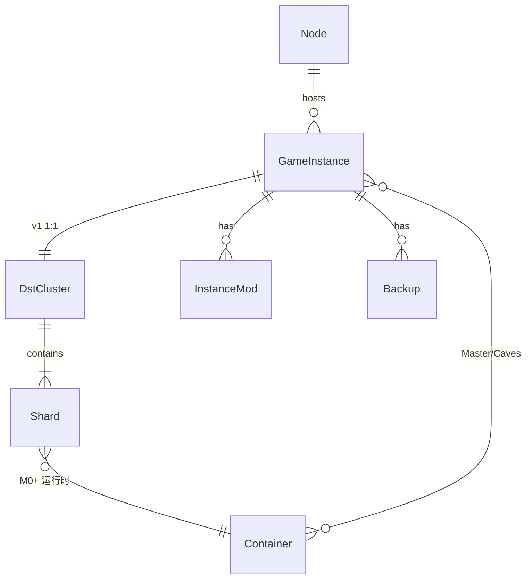

# GameServerHub 领域词典与数据模型

> 全员引用本文档统一名词，FDS / API 文档不再重复定义。  
> 最后更新：2026-05-18

## 1. 概念关系总览




| 概念          | 英文/代码                           | 说明                                            |
| ----------- | ------------------------------- | --------------------------------------------- |
| **面板**      | Panel                           | GameServerHub 自身（Web + API），v1 运行在 `panel` 容器 |
| **节点**      | Node                            | 可运行游戏实例的机器；v1 仅 `local-node`                  |
| **实例**      | GameInstance / `game_instances` | 面板管理单元：一套安装目录 + 一个 DST Cluster + 若干 Shard 容器  |
| **房间**      | Cluster                         | DST `cluster.ini` 所在目录，玩家看到的「房间」              |
| **世界 / 分片** | Shard                           | Master（地表）、Caves（洞穴）；各 shard 独立 `server.ini`  |
| **游戏**      | Game / `gameCode`               | v1 仅 `343050`（DST）；与 Steam AppID 一致           |
| **Mod**     | Workshop Mod                    | 创意工坊条目，映射 `instance_mods` 与磁盘 mod 文件          |
| **备份**      | Backup                          | Cluster 相关数据与配置的归档包                           |


### v1 约束（ADR-002）

- **1 实例 : 1 Cluster**（不在 v1 做一实例多 Cluster）。
- **1 Cluster : 1～2 Shard**（Master 必选，Caves 可选）。

## 2. DST 文件系统布局

安装路径记为 `{installPath}`（实例字段 `install_path`）。

```text
{installPath}/
├── bin64/                          # DST 服务端二进制
├── steam_appid.txt
├── start.sh | start.cmd            # 可选启动脚本（过渡期）
└── klei-storage/                   # 常量 DST_STORAGE_DIR
    └── DoNotStarveTogether/        # 常量 DST_CONF_DIR
        └── {clusterName}/          # 默认历史实现 Cluster_1
            ├── cluster.ini           # 房间配置
            ├── Master/
            │   ├── server.ini
            │   ├── worldgenoverride.lua
            │   └── save/ ...         # 运行时生成
            └── Caves/                # 启用洞穴时
                ├── server.ini
                └── worldgenoverride.lua
```

当前代码默认：`clusterName = Cluster_1`（见 `server/src/modules/instance/index.ts`）。目标态由 [FDS-03](FDS/03-dst-cluster.md) 支持自定义名称。

### 启动参数（容器内等价）

```text
-persistent_storage_root {storageRoot}
-conf_dir DoNotStarveTogether
-cluster {clusterName}
-shard Master | Caves
-console
```

## 3. 数据库表（SQLite）

路径默认：`server/data/game-server-hub.sqlite`（见 `PROJECT_BASELINE.md`）。

### 3.1 `game_instances`


| 字段                                  | 类型      | 说明                                                                 |
| ----------------------------------- | ------- | ------------------------------------------------------------------ |
| `id`                                | text PK | 实例 UUID                                                            |
| `node_id`                           | text    | v1 恒为 `local-node`                                                 |
| `name`                              | text    | 展示名                                                                |
| `game_code`                         | text    | v1：`343050`                                                        |
| `status`                            | text    | `pending_install` | `installing` | `stopped` | `running` | `error` |
| `container_id`                      | text    | **目标态** Master 容器 ID；代码已写库，Compose 栈验收见场景 C                              |
| `runtime_pid`                       | integer | **遗留字段**，容器运行态下一般为空；勿作为运行判断依据                                      |
| `runtime_started_at`                | text    | ISO 时间                                                             |
| `install_path`                      | text    | 游戏安装根目录（挂载卷内路径）                                                    |
| `config_path`                       | text    | 预留                                                                 |
| `game_port` 等                       | integer | 端口映射                                                               |
| `install_percent` / `install_log_`* |         | 安装进度                                                               |
| `update_available` / `*_build_id`   |         | Steam 更新检测                                                         |


### 3.2 `instance_mods`（规划使用）


| 字段            | 说明      |
| ------------- | ------- |
| `instance_id` | 所属实例    |
| `workshop_id` | 创意工坊 ID |
| `enabled`     | 是否启用    |
| `load_order`  | 加载顺序    |


### 3.3 `backups`（规划使用）


| 字段            | 说明     |
| ------------- | ------ |
| `instance_id` | 所属实例   |
| `file_path`   | 归档文件路径 |
| `size_bytes`  | 大小     |
| `note`        | 备注     |


### 3.4 规划扩展（M0+）


| 表/字段                                     | 用途                           |
| ---------------------------------------- | ---------------------------- |
| `dst_clusters` 或实例扩展 JSON                | Cluster 名、与实例绑定（若不用 1:1 可演进） |
| `container_service` / `shard_containers` | Master/Caves 容器名映射           |


具体表结构在 M0 设计时写入 ADR 或迁移说明。

## 4. 实例状态机

```text
pending_install → installing → stopped ⇄ running
                    ↓              ↓
                  error          error
```


| 状态                | 用户可见含义                 |
| ----------------- | ---------------------- |
| `pending_install` | 已创建，尚未开始安装             |
| `installing`      | SteamCMD 安装中           |
| `stopped`         | 已安装，未运行                |
| `running`         | 至少 Master 容器/进程在运行     |
| `error`           | 安装或运行失败，见 `last_error` |


M0 目标：`running` 以 Docker 容器实际状态为准（`container_id` + inspect）；DB 与 reconcile 对齐。**场景 C 通过前勿视为已验收。**

## 5. 端口约定（DST 默认）


| 用途         | 默认    | 配置位置                                        |
| ---------- | ----- | ------------------------------------------- |
| 游戏端口       | 10999 | `Master/server.ini` `[NETWORK] server_port` |
| Steam 主站   | 8766  | `[STEAM] authentication_port`               |
| Steam 主站备用 | 12346 | `master_server_port`                        |


洞穴 shard 使用独立 `server.ini` 端口段，由 [FDS-04](FDS/04-dst-shard.md) 定义偏移规则。

## 6. 版本与功能标识


| 标识                              | 含义         |
| ------------------------------- | ---------- |
| `GSH_EDITION=community` | `pro` | 运行时版本（规划）  |
| `gameCode=343050`               | DST 适配器路由键 |


## 7. 与其他文档的引用

- 房间业务规则 → [FDS-03](FDS/03-dst-cluster.md)  
- 世界/洞穴 → [FDS-04](FDS/04-dst-shard.md)  
- 容器拓扑 → [ARCHITECTURE.md](ARCHITECTURE.md)  
- API 字段 → [API.md](API.md)

---

*名词冲突时以本文档为准，变更需同步相关 FDS。*