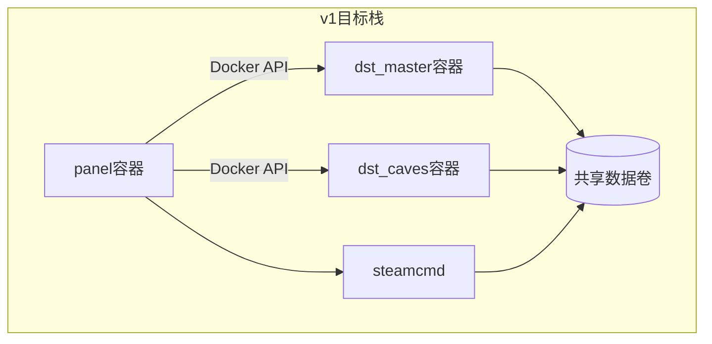

# GameServerHub 产品路线图与开发清单

> **定位**：开源 Steam 游戏一键开服面板（Community）+ 商业高级版（Pro）  
> **v1 聚焦**：饥荒联机版（DST，Steam AppID `343050`）做深做透  
> **本文档**：产品范围 + 里程碑 + 可执行任务的唯一执行清单（不依赖外部 `DEVELOPMENT.md`）  
> **最后同步**：2026-05-18（对照仓库 `server/src`、`src/views`、`scripts` 实现核对）

---

## 1. 产品定位与成功指标

### 1.1 我们要做什么

GameServerHub 面向个人与小团队，提供 **「装得上、开得起来、管得住」** 的 Steam 专用游戏服务器面板：

- **开源 Community**：在单机上完整体验 DST 一键开服（安装 → 房间 → 世界 → Mod → 备份 → 运维），建立口碑与贡献者生态。
- **商业 Pro**：在 Community 闭环之上，售卖省心（自动化、云备份）、规模（多节点、更多实例策略）、协作与托管商业化能力（RBAC、审计、白标 API 等，分阶段交付）。

长期商业模式：产品打磨好后，与云服务器厂商合作——从 **卖工具（License）** 转向 **卖服务（预装镜像 + 托管节点）**；该方向列入 **M4 / v2+**，不阻塞 v1 自托管闭环。

### 1.2 域模型约定（DST）

| 产品用语 | 技术对应 | 说明 |
|---------|---------|------|
| **房间** | Cluster | `klei-storage/DoNotStarveTogether/<cluster>/cluster.ini` |
| **世界 / 分片** | Shard | Master（地表）、Caves（洞穴）；各 shard 独立 `server.ini`、`worldgenoverride.lua` |
| **实例** | Panel 管理单元 | 对应一组容器 + 数据卷；v1 建议 **1 实例 ↔ 1 Cluster** |

### 1.3 v1 成功指标（验收口径）

| 指标 | 目标 |
|------|------|
| 安装 | 新用户 **≤10 分钟** 完成 Linux 一键栈部署（Docker Compose） |
| 开服 | **≤15 分钟** 完成 DST 从创建实例到可进服（含 SteamCMD 拉取、房间/世界默认配置、Master 运行；洞穴可选） |
| 稳定 | 面板空闲资源：CPU &lt; 5%，内存 &lt; 200MB（不含游戏容器） |
| 质量 | 阻塞 Bug 清零；严重 Bug 清零；一般 Bug ≤10（发布前） |
| 商业 | Community 可独立闭环；Pro 功能开关方案在 **M3 前定稿**（见 §9） |

### 1.4 刻意不在 v1 的范围

- 泰拉瑞亚、Valheim 等新游戏（→ v1.x 游戏适配器）
- 多节点远程 Agent、云厂商白标、多租户（→ M4 / v2+）
- Windows Server 安装包（→ v1.x）
- 托管 SaaS 控制面（→ 授权方案确定后单独立项）

---

## 2. 版本与发布策略

### 2.1 版本线

| 版本 | 交付物 | 说明 |
|------|--------|------|
| **Community** | 开源仓库、Compose 栈、文档 | 单节点 DST 全流程免费 |
| **Pro** | 同一安装包 + License 或独立构建（**待定 §9**） | 解锁自动化、云备份、高级编辑、多节点等 |
| **v1.0** | DST + 全容器化运行时 + M1/M2 核心模块 | 首个对外宣传版本 |
| **v1.x** | 第二款游戏适配器 | 在 `gameCode` 框架上扩展 |
| **v2.0** | 云合作、多节点 Agent | 与商业扩展绑定 |

### 2.2 优先级定义

- **P0**：阻塞核心闭环或 M0 架构；必须先完成。
- **P1**：决定「可用 → 好用」；v1.0 强烈建议完成。
- **P2**：可后置；不阻塞 v1.0 标签发布。

### 2.3 状态标记

- `[x]` 已完成（部分项标注 **需 M0 回归**，表示逻辑已有但容器化后需重验）
- `[~]` 部分完成
- `[ ]` 未开始

### 2.4 待确认（不阻塞本文档维护）

| 项 | 选项 | 当前建议 |
|----|------|---------|
| Community 实例数上限 | 不限 / 软限 3 | **软限 3**（Pro 卖点：不限或更高上限） |
| Pro 首发是否必须 License 服务 | M3 仅开关 / M3 必须在线激活 | **M3 功能开关 + 离线 Key 预留接口**；完整激活服务可 M3.5 |

---

## 3. 模块地图与导航结构

### 3.1 产品模块（0–14）

| ID | 模块 | 用户价值 | v1 优先级 |
|----|------|---------|----------|
| 0 | 平台基础与安装 | 装得上、能登录、能升级 | P0 |
| 1 | 面板监控台 | 看得见主机与网络状态 | P0 |
| 2 | 节点与实例 | 下载游戏服、管生命周期 | P0 |
| 3 | DST 房间（Cluster） | 房名、密码、人数、模式 | P0 |
| 4 | DST 世界（Shard） | 地表/洞穴、地图预设 | P0 |
| 5 | Steam Workshop Mod | 搜、装、排序、依赖提示 | P1 |
| 6 | 备份管理 | 存档与配置可恢复 | P1 |
| 7 | 配置中心 | 高级 INI/LUA 可视化 | P0 |
| 8 | 文件管理 | 沙箱内排查与手工上传 | P1 |
| 9 | 实例控制台 | 日志、命令、快捷运维 | P0 |
| 10 | 玩家与访问 | 白名单、管理员、封禁 | P1 |
| 11 | 计划任务 | 定时重启/备份/更新 | P2（Pro） |
| 12 | 通知与审计 | Webhook、操作记录 | P2（Pro） |
| 13 | 新手引导 | 降学习成本 | P1 |
| 14 | 游戏适配器 | 多游戏扩展点 | P0 框架 / v1.x 新游戏 |

### 3.2 目标导航结构（规划）

当前菜单见 `src/api/modules/app.fake.ts`（仅：监控台、实例管理、系统设置）。v1 目标扩展：

```text
控制台
  └─ 监控台                    [已有] console/monitor
节点
  └─ 实例管理                  [已有] node/instance
  └─ 实例控制台                [已有] 隐藏菜单
饥荒（DST）                    [规划] 可按实例上下文进入，或独立域
  └─ 房间管理                  [ ] dst/cluster
  └─ 世界管理                  [ ] dst/shard
  └─ Mod 管理                  [ ] dst/mod 或 instance/:id/mods
运维
  └─ 备份管理                  [ ] backup
  └─ 文件管理                  [ ] file
系统
  └─ 系统设置                  [已有] system/settings
  └─ 游戏目录 / SteamCMD       [~] 部分在实例页 SteamcmdPanel
```

---

## 4. 实现状态总览

| 领域 | 状态 | 说明 | 主要路径 |
|------|------|------|---------|
| 工程基础 / 本地开发 | [x] | Monorepo、`pnpm dev` / `dev:compose`、环境校验、统一错误码与响应 | `docs/PROJECT_BASELINE.md`、`server/src/shared/config` |
| Linux 安装脚本 | [x] | Docker + Compose 一键部署；不安装宿主机 Node/SteamCMD | `scripts/install.linux.sh`、`docker-compose.bind.yml` |
| 全容器化运行时 | [~] | 基础设施代码已合并；节点/实例/SteamCMD 链路须在 Compose 栈回归（场景 C，模块 2） | `server/src/infra/container`、`server/src/modules/instance` |
| 认证与会话 | [x] 需 M0 回归 | 登录/登出/改密/强制改密 | `server/src/modules/auth` |
| 监控台 | [x] 需 M0 回归 | 系统信息、CPU/内存/磁盘、Docker、网卡流量 | `server/src/modules/console`、`src/views/console/monitor` |
| 节点与资源 | [x] 需 M0 回归 | 本地节点 `onReady`、资源快照 | `server/src/modules/node` |
| 实例生命周期 | [x] 需 M0 回归 | CRUD、启停、指标、安装日志、手动更新 | `server/src/modules/instance`、`src/views/node/instance` |
| DST 安装与默认 Cluster | [~] 需 M0 回归 | 仅固定 `Cluster_1` + Master；无洞穴容器 | `server/src/modules/instance`（`ensureDstClusterConfig`） |
| 游戏市场 | [ ] | 创建弹窗内选游戏；无独立市场页 | `/app/instance/games` |
| 实例控制台 | [~] 需 M0 回归 | SSE 日志 + stdin 命令；无补全/快捷命令 | `server/src/modules/console`、`src/views/node/instance/console.vue` |
| DST 房间管理 | [ ] | 无 Cluster CRUD API/页面 | — |
| DST 世界管理 | [ ] | 无 Shard/洞穴编排 | — |
| Mod | [ ] | 模块占位；`instance_mods` 表已建 | `server/src/modules/mod`、`server/src/shared/db/schema/instance.ts` |
| 配置中心 | [ ] | 模块占位 | `server/src/modules/config` |
| 备份 | [ ] | 模块占位；`backups` 表已建 | `server/src/modules/backup` |
| 文件管理 | [ ] | 模块占位；仅安装路径浏览 | `server/src/modules/file`、`/app/system/filesystem/*` |
| 玩家与访问 | [ ] | — | — |
| 计划任务 / 通知 / 审计 | [ ] | — | — |
| 新手引导 | [ ] | — | — |
| 游戏适配器框架 | [~] | `gameCode` 分支已有 DST；无插件契约文档 | `server/src/modules/instance` |
| Pro / License | [ ] | — | — |
| 发布验收 | [ ] | — | — |

**已注册后端模块**（`server/src/app.ts`）：`auth`、`system`、`node`、`instance`、`console`。  
**仅占位未注册**：`mod`、`config`、`backup`、`file`。

---

## 5. 部署架构

### 5.1 已决策：v1 全容器化

| 组件 | 目标形态 |
|------|---------|
| 面板 | `panel` 容器（Fastify + 静态前端） |
| SteamCMD | `steamcmd` 容器或一次性 init Job |
| DST 实例 | 每 Shard 一容器（Master / Caves）；共享 Cluster 数据卷 |
| 编排 | 根目录 `docker-compose.yml` + 按实例动态服务名 `game-{instanceId}-master` 等 |
| 面板控容器 | 挂载 Docker Socket（或 rootless 等价方案），`ContainerRuntime` 抽象 |

### 5.2 现状与差距

| 维度 | 当前实现 | v1 目标 |
|------|---------|---------|
| 开发环境 | `pnpm dev`（宿主机）与 `pnpm dev:compose`（推荐，与生产同栈）并存 | 长期以 `dev:compose` 为主，宿主机 `dev` 作快速迭代 |
| 生产安装 | 安装脚本仅装 Docker + 拉 Compose 起 panel；SteamCMD 按需容器任务 | 与目标一致 |
| 实例运行时 | 代码已接 `ContainerRuntime`；**Compose 下未验收**（场景 C） | 容器态启停/安装/指标与控制台对齐 |
| DST 洞穴 | 仅 Master 容器 | Master + Caves 两容器，共享 volume |
| 仓库交付 | 根 `Dockerfile`、`docker/game-dst`、GHCR CI | 与目标一致 |



### 5.3 全容器化 vs 宿主机直启（决策记录）

| 维度 | 宿主机直启（现状） | 全容器化（v1） |
|------|-------------------|----------------|
| 安装一致性 | 开发/生产易分裂 | Compose 单一路径 |
| DST 洞穴 | 难多进程隔离 | 天然多容器 |
| 资源隔离 | 弱 | cgroup / 端口映射清晰 |
| 云厂商预装 | 需定制脚本 | 镜像 + Compose 易合作 |
| 实现成本 | 已投入 | **高**（运行时、卷、日志、权限） |
| 风险 | 低 | Socket 安全、卷 UID、Windows 更远 |

**原则**：M0 完成前，新功能开发应在 Compose 开发栈上验收；已有 `[x]` 能力在 M0 后做回归清单。

### 5.4 M0 关键技术任务（摘要）

- [x] 根目录 `Dockerfile`（panel）、`docker/game-dst/Dockerfile` 游戏基底镜像
- [x] `docker-compose.yml`：`panel`、卷与 Docker socket；`steamcmd` 为 `tools` profile（按需拉取镜像执行任务）
- [~] `server/src/infra/container/`：`ContainerRuntime` 接口已落地；**Compose 栈回归待场景 C**
- [~] `server/src/modules/instance`：启停/安装已改调容器 API；**须在 panel 容器环境验收**
- [ ] DST：Caves Shard 容器可选启动（见 FDS-04 / 模块 4）
- [x] `scripts/install.linux.sh`：仅安装 Docker + 拉栈
- [x] 文档：根 README 安装与 Compose 快速开始（见 §11）

---

## 6. 里程碑

### M0 — 架构对齐（全容器化，阻塞一切）

**目标**：开发/生产同一套 Compose；实例启停、日志、安装均在容器态可验证。

**退出标准**：

- [x] 新装主机仅执行安装脚本即可访问面板（验收场景 A，2026-05-18）
- [ ] 创建 DST 实例 → SteamCMD 装服 → Master 容器运行 → 可进服（场景 C；依赖模块 2 等在 Compose 下回归）
- [x] 开发文档说明推荐 `dev:compose`（见 [CONTRIBUTING.md](CONTRIBUTING.md)、[RUNBOOK.md](RUNBOOK.md)）

**建议周期**：与其他 P0 并行，但为最高优先级。

---

### M1 — DST 开服闭环

**目标**：产品语义上的「一键开服」在 Community 单节点跑通。

包含：实例 + 房间 + 世界 + 配置 + 控制台 + 监控（容器态）。

**退出标准**：

- [ ] 用户可创建房间（Cluster）、配置地表/洞穴（Shard）、启停、改密进服
- [ ] 配置中心可改常用项并保存生效（含重启提示）
- [ ] 10+15 分钟验收通过（§1.3）

---

### M2 — 体验与留存

**目标**：Mod、备份、文件、新手引导上线，提升日活与口碑。

**退出标准**：

- [ ] Mod：搜索、安装、排序、基础依赖/冲突提示可用
- [ ] 备份：手动备份/恢复；Community 保留 ≤3 份自动清理
- [ ] 文件：实例沙箱内浏览/编辑文本
- [ ] 新手引导：首次登录 5 步可跳过

---

### M3 — 商业化准备

**目标**：Pro 边界可演示；授权方案定稿；对外安装入口完整。

**退出标准**：

- [ ] Community / Pro 功能开关（环境变量或 License 占位）
- [ ] §9 授权方案选定并文档化
- [ ] README：安装命令、已知限制、回滚
- [ ] v1.0.0 发布清单与 Bug 门槛（§1.3）

---

### M4 — 扩展

- [ ] v1.x：第二款游戏（适配器 + 市场卡片）
- [ ] v2：多节点 Agent、云镜像规范、白标/多租户雏形
- [ ] Pro：定时任务、云备份、历史监控、RBAC（按 Pro 矩阵分批）

---

## 7. 按模块任务清单

### 模块 0 — 平台基础与安装

| 优先级 | 状态 | 任务 | 验收标准 | 主要文件 |
|--------|------|------|---------|---------|
| P0 | [x] | Linux 一键安装脚本 | Ubuntu/Debian 可装 Docker、拉栈、输出 URL/初始密码 | `scripts/install.linux.sh` |
| P0 | [x] | 安装脚本与全容器化对齐 | 不依赖宿主机 Node/SteamCMD；面板 Compose 部署 | `scripts/install.linux.sh`、`docker-compose.yml` |
| P0 | [x] | 面板与游戏 Dockerfile + CI 构建 | GHCR 推送 panel / game-dst | `Dockerfile`、`docker/game-dst`、`/.github/workflows/docker-publish.yml` |
| P0 | [x] 需 M0 回归 | 本地 `pnpm dev` + `dev:prepare` | 开发者可启前后端 | `package.json`、`server/scripts/dev.prepare.ts` |
| P0 | [x] | `dev:compose` 开发栈 | 与生产同栈；panel + web 热更新 | `docker-compose.dev.yml`、`pnpm run dev:compose` |
| P0 | [x] 需 M0 回归 | 环境变量 zod 校验 | 缺配启动失败 | `server/src/shared/config/index.ts` |
| P0 | [x] 需 M0 回归 | 统一错误码与响应体 | 前后端一致 | `shared/constants/error-code.ts`、`server/src/shared/http/response.ts` |
| P0 | [x] 需 M0 回归 | 首次登录强制改密 | `FORCE_PASSWORD_CHANGE` 拦截 API | `server/src/modules/auth`、`src/views/force-change-password.vue` |
| P0 | [~] | `ContainerRuntime` + SteamCMD 容器安装 | 代码已落地；Compose 下实例链路待回归（场景 C / 模块 2） | `server/src/infra/container`、`steamcmd-runner.ts` |
| P1 | [ ] | 面板自更新检查 | 设置页展示新版本与更新指引 | `server/src/modules/system`、设置页 |
| P1 | [~] | 安装失败回滚与重试可视化 | 脚本 `rollback_install` + `install.status`；无 UI 指引 | `scripts/install.linux.sh` |
| P2 | [ ] | Windows Server 安装包 | 签名、服务化 | 后置 |

---

### 模块 1 — 面板监控台

| 优先级 | 状态 | 任务 | 验收标准 | 主要文件 |
|--------|------|------|---------|---------|
| P0 | [x] 需 M0 回归 | CPU/内存/磁盘/系统概览 | 10s 轮询稳定 | `src/views/console/monitor`、`server/src/modules/console` |
| P0 | [x] 需 M0 回归 | 网卡实时流量图 | 上下行速率正确 | `MonitorNetwork.vue` |
| P0 | [x] 需 M0 回归 | Docker 信息卡片 | 显示引擎版本与容器数 | `DockerInfoCard.vue` |
| P1 | [ ] | 游戏端口/实例容器状态联动 | 实例页与监控台一致 | 待设计 API |
| P1 | [~] | 网络配置编排前端 | 后端已有 `/app/system/network/*`，缺页面 | `server/src/modules/system`、`src/views/system` |
| P2 Pro | [ ] | 历史指标与告警规则 | 可配置阈值通知 | M4 |

---

### 模块 2 — 节点与实例

| 优先级 | 状态 | 任务 | 验收标准 | 主要文件 |
|--------|------|------|---------|---------|
| P0 | [x] 需 M0 回归 | 本地节点注册与资源快照 | 启动后可见 CPU/内存/磁盘 | `server/src/modules/node` |
| P0 | [x] 需 M0 回归 | 实例 CRUD + 状态机 | pending_install → installing → stopped/running/error | `server/src/modules/instance`、`game_instances` |
| P0 | [x] 需 M0 回归 | 启停/重启/删除 + 二次确认 | 危险操作有确认 | `InstanceManagement.vue` |
| P0 | [x] 需 M0 回归 | SteamCMD 安装与进度 | 流式日志、installPercent | `installInstanceFilesInBackground` |
| P0 | [x] 需 M0 回归 | 手动更新服务端 API | `POST /app/instance/update` | instance 模块 |
| P0 | [x] 需 M0 回归 | 列表 CPU/内存/运行时长 | 5s 轮询 metrics | `POST /app/instance/metrics` |
| P0 | [~] | 容器运行时接入 | 代码已接 Docker；Compose 栈下启停/安装/指标待回归（场景 C） | `ContainerRuntime`、`container-lifecycle.ts` |
| P0 | [ ] | 独立「游戏」市场页 | 仅 DST 卡片，跳转创建实例 | `src/views/`、`app.fake.ts` |
| P1 | [ ] | 安装阶段字段 `installPhase` | 独立语义，非 `lastCommand` 文案 | DB 迁移 |
| P1 | [ ] | 安装失败/端口冲突统一排障文案 | 三类错误模板 | 前后端 |
| P2 Pro | [ ] | 远程节点与 Agent | 多机管理 | M4 |

---

### 模块 3 — DST 房间管理（Cluster）

| 优先级 | 状态 | 任务 | 验收标准 | 主要文件 |
|--------|------|------|---------|---------|
| P0 | [~] | 安装时生成默认 Cluster | 当前固定 `Cluster_1` | `ensureDstClusterConfig` |
| P0 | [ ] | Cluster CRUD API | 创建/重命名/删除（删前确认） | `server/src/modules/dst` 或 `instance` 子域 |
| P0 | [ ] | `cluster.ini` 可视化表单 | 房名、密码、人数、模式、intention、离线/LAN 等 | 新页面 `src/views/dst/cluster` |
| P0 | [ ] | 保存后生效策略 | 提示重启 shard / 滚动重启 | 与模块 4 编排联动 |
| P1 Pro | [ ] | 多 Cluster 模板库 | 快速套用预设房间 | Pro 开关 |

---

### 模块 4 — DST 世界管理（Shard）

| 优先级 | 状态 | 任务 | 验收标准 | 主要文件 |
|--------|------|------|---------|---------|
| P0 | [~] | 默认 Master `server.ini` + worldgen | 安装时写入 | `buildDstMasterServerIni`、`buildDstWorldgenOverride` |
| P0 | [ ] | 洞穴 Shard 开关 | 启用后创建 Caves 容器与配置 | M0 + 本模块 |
| P0 | [ ] | Shard 级 `server.ini` 编辑 | 端口、Steam 端口段 | API + 表单 |
| P0 | [ ] | Worldgen 预设选择 | `SURVIVAL_TOGETHER` 等 | 生成 `worldgenoverride.lua` |
| P0 | [ ] | 启停编排 | 先 Master 后 Caves；停止逆序 | ContainerRuntime |
| P1 | [ ] | 控制台按 Shard 发令或统一路由 | 用户知悉命令作用于哪一分片 | `console` 模块 |
| P1 Pro | [ ] | 高级 worldgen 可视化编辑 | overrides 表单项 | Pro |

---

### 模块 5 — Steam Workshop Mod

| 优先级 | 状态 | 任务 | 验收标准 | 主要文件 |
|--------|------|------|---------|---------|
| P1 | [ ] | 注册 `mod` 模块 | 路由挂 `/app/instance/:id/mods` | `server/src/modules/mod`、`app.ts` |
| P1 | [ ] | 创意工坊搜索与详情 | 关键词、预览、订阅数等 | Steam Web API 封装 |
| P1 | [ ] | 一键安装/卸载 | 写入 `instance_mods` + 游戏目录 | `instance_mods` 表 |
| P1 | [ ] | 启用/禁用、加载顺序拖拽 | 写 `modoverrides.lua` 或等价 | DST 适配器 |
| P1 | [ ] | 基础依赖与冲突提示 | 解析 depends 元数据；冲突列表 | Community |
| P1 Pro | [ ] | 合集、批量、自动更新 | 需 Pro | — |
| P1 Pro | [ ] | 深度冲突解析向导 | 需 Pro | — |

---

### 模块 6 — 备份管理

| 优先级 | 状态 | 任务 | 验收标准 | 主要文件 |
|--------|------|------|---------|---------|
| P1 | [ ] | 注册 `backup` 模块 | CRUD 路由可用 | `server/src/modules/backup` |
| P1 | [ ] | 手动备份 | 打包 Cluster 卷 + 关键 ini/lua | 备份存储路径规范 |
| P1 | [ ] | 备份列表/备注/重命名 | 展示大小、时间 | `backups` 表 |
| P1 | [ ] | 恢复 + 二次确认 | 恢复前停服可选 | — |
| P1 | [ ] | Community 保留策略 | 最多 3 份，超限删最早 | 业务规则 |
| P2 Pro | [ ] | 定时备份 Cron | 需 Pro | M3/M4 |
| P2 Pro | [ ] | S3/OSS/COS 目的地 | 需 Pro | M4 |

---

### 模块 7 — 配置中心

| 优先级 | 状态 | 任务 | 验收标准 | 主要文件 |
|--------|------|------|---------|---------|
| P0 | [ ] | 注册 `config` 模块 | 读写 API | `server/src/modules/config` |
| P0 | [ ] | 解析层 `.ini` / `.lua` / `.json` | 结构化读写 | `server/src/infra/config-parser` |
| P0 | [ ] | DST 常用项表单 | 与房间/世界不重复项 | 页面 + schema |
| P0 | [ ] | 保存校验与重启确认 | 格式错误可定位行 | — |
| P1 | [ ] | 原始编辑器 | 语法高亮 | P2 可增强 diff |

---

### 模块 8 — 文件管理

| 优先级 | 状态 | 任务 | 验收标准 | 主要文件 |
|--------|------|------|---------|---------|
| P1 | [ ] | 注册 `file` 模块 | 实例沙箱路径 | `server/src/modules/file` |
| P1 | [ ] | 目录浏览 | 禁止 `..` 与系统目录 | 复用路径校验思路 |
| P1 | [ ] | 上传/下载/删除/重命名/新建目录 | 权限仅管理员 | — |
| P1 | [ ] | 文本在线编辑 | 小文件安全限制大小 | — |
| P0 | [~] | 安装根目录选择器 | 仅系统级浏览 | `/app/system/filesystem/*` |

---

### 模块 9 — 实例控制台

| 优先级 | 状态 | 任务 | 验收标准 | 主要文件 |
|--------|------|------|---------|---------|
| P0 | [x] 需 M0 回归 | SSE 日志流 + 轮询补齐 | 断线可恢复 | `server/src/modules/console` |
| P0 | [x] 需 M0 回归 | stdin 命令下发 | 运行中可发 Lua | `POST .../console/command` |
| P0 | [x] 需 M0 回归 | 自动滚动/清空/复制 | UI 可用 | `console.vue` |
| P0 | [x] 需 M0 回归 | 重启后 reconcile 僵尸 running | DB 与进程/容器一致 | `reconcileStaleRunningInstances` |
| P0 | [ ] | M0 后日志源切换 | Docker logs 与 SSE 对接 | console + ContainerRuntime |
| P0 | [ ] | 命令历史与补全 | ↑/↓、按 `gameCode` 候选 | 前后端 |
| P0 | [ ] | 快捷命令（DST） | 保存、回档 1–6 天、重置（确认） | 预设表 + 按钮区 |
| P1 | [ ] | 日志下载 | 导出文件 | — |

---

### 模块 10 — 玩家与访问

| 优先级 | 状态 | 任务 | 验收标准 | 主要文件 |
|--------|------|------|---------|---------|
| P1 | [ ] | `adminlist` / `blocklist` / 白名单 UI | 与 Cluster 绑定 | DST 文件 |
| P1 | [ ] | 玩家列表（若可读存档或 API） | 在线玩家展示 | 调研 DST 能力 |
| P2 | [ ] | 封禁时长与原因备注 | — | — |

---

### 模块 11 — 计划任务（Pro）

| 优先级 | 状态 | 任务 | 验收标准 |
|--------|------|------|---------|
| P2 | [ ] | 定时重启实例 | Cron 表达式 + 时区 |
| P2 | [ ] | 定时备份 | 依赖模块 6 |
| P2 | [ ] | 定时 Steam 更新窗口 | 低峰执行 |

---

### 模块 12 — 通知与审计（Pro）

| 优先级 | 状态 | 任务 | 验收标准 |
|--------|------|------|---------|
| P2 | [ ] | Webhook（Discord/飞书/钉钉） | 实例宕机、备份结果 |
| P2 | [ ] | 操作审计日志 | 登录、启停、删除、恢复 |
| P2 | [ ] | 统一鉴权中间件 | 替代各模块重复 `verifyAuthorized` |

---

### 模块 13 — 新手引导

| 优先级 | 状态 | 任务 | 验收标准 |
|--------|------|------|---------|
| P1 | [ ] | 首次登录 5 步引导 | 可跳过、可再次打开 |
| P1 | [ ] | 各页帮助入口 | 链到文档锚点 |
| P1 | [ ] | FAQ / 社区链接 | QQ、Discord、GitHub Discussions |

---

### 模块 14 — 游戏适配器框架

| 优先级 | 状态 | 任务 | 验收标准 | 主要文件 |
|--------|------|------|---------|---------|
| P0 | [~] | `gameCode` 分支（DST） | 安装/启动/配置钩子 | `instance/index.ts` |
| P0 | [ ] | 适配器接口文档 | install、launch、cluster、shard、mods、backup | `docs/` 或 `server/src/infra/game-adapter` |
| P0 | [ ] | 控制台命令表按游戏扩展 | 非 DST 可插命令集 | console |
| v1.x | [ ] | 第二款游戏实现 | 市场可见 | 新 adapter |

---

## 8. Community / Pro 功能对照表

| 能力 | Community | Pro |
|------|-----------|-----|
| 部署 | 单机 Docker Compose 开源栈 | 官方加固镜像/优先更新通道（可选） |
| 节点 | 仅 `local-node` | 多节点 / 远程 Agent（v2） |
| 实例数 | **建议软限 3**（待确认 §2.4） | 不限或更高 |
| DST 房间/世界 | Cluster/Shard CRUD、洞穴、基础 worldgen | 高级 worldgen 编辑器、Cluster 模板库 |
| Mod | 搜索/安装/卸载/排序/基础依赖冲突提示 | 合集、批量、自动更新、深度冲突向导 |
| 备份 | 手动；最多保留 **3** 份 | 定时、增量、云存储 |
| 监控 | 实时 | 历史曲线、告警 |
| 控制台 | 日志、命令、DST 快捷命令 | + 审计关联 |
| 计划任务 | — | 定时重启/备份/更新 |
| 通知 | — | Webhook 等 |
| 账号 | 单管理员 | 多用户 RBAC（v2） |
| 支持 | 社区文档 / Issues | 商业支持渠道 |

**原则**：Community 必须在单机上完成 DST **一键开服全流程**；Pro 不卖「能开服」，而卖「更省心、更大规模、更可托管」。

### 开发期占位（M3 前）

```bash
# panel.env 或容器环境
GSH_EDITION=community   # 默认
GSH_EDITION=pro         # 本地验证 Pro 功能
```

```typescript
function isProEdition(): boolean {
  return process.env.GSH_EDITION === 'pro'
}
```

- 上表为 **Community / Pro 边界唯一来源**；规划集中 `features.pro` 注册表，避免各模块散落硬编码。
- 调整边界 → 只改本节 + 相关 FDS 的 Community/Pro 列；若涉授权同步 [adr/003](adr/003-pro-license-tbd.md)。

---

## 9. 授权方案对比（待定）

| 方案 | 描述 | 优点 | 缺点 | 建议阶段 |
|------|------|------|------|---------|
| A. 同包 + License Key | 开源构建 + 在线/离线激活解锁 Pro | 发行简单、用户自托管 | 破解与密钥管理成本 | M3 首选评估 |
| B. 双仓库/双镜像 | Community 开源，Pro 私有构建 | 逻辑隔离清晰 | 双份 CI、合并成本高 | 适合强 Pro 差异 |
| C. 托管 SaaS | 云厂商卖预装镜像+面板 | 易与合作方分润 | 运维控制面复杂 | M4 与云合作绑定 |

**定稿时限**：不阻塞 M1；**M3 发布前必须选定**并实现最小 Pro 开关（哪怕仅环境变量 `GSH_EDITION=pro`）。

---

## 10. 风险与技术债

| 风险 | 影响 | 缓解 |
|------|------|------|
| M0 延期 | 所有「已完成」无法在生产验证 | 并行排期；M0 子项周更状态 |
| Docker Socket 暴露 | 面板被攻破等于宿主机失控 | 非 root 容器、只读 socket、最小权限 |
| DST 双容器存档锁 | 同卷并发写损坏 | 明确启停顺序；单写者约定 |
| Steam API 限流 | Mod 搜索不可用 | 缓存、降级提示 |
| 授权未定 | Pro 功能散落 | M2 起新功能标 Pro/Community |
| `InstanceManagement.vue` 过大 | 维护难 | 继续拆分子组件 |
| 硬编码监控色值 | 主题 token 不一致 | 换 `status.*` token（见 `packages/themes`、`uno.config.ts`） |

---

## 11. 本周建议开工项（滚动）

按依赖排序（2026-05-18）：

1. **[x] M0-1**：根目录 `docker-compose.yml` + `Dockerfile`（panel），`docker compose up` / 安装脚本可访问面板。
2. **[~] M0-2**：`ContainerRuntime` + 实例启停已接代码；**Compose 回归待场景 C**。
3. **[~] M0-3**：SteamCMD 容器化安装已接代码；**panel 容器环境下待验收**。
4. **[x] M1 并行设计**：DST Cluster/Shard 已写 [FDS-03](FDS/03-dst-cluster.md)、[FDS-04](FDS/04-dst-shard.md)（实现待 M0 后）。
5. **[ ] 文档**：仓库根 README 增加 Compose 快速开始（安装命令占位）；产品文档见 [README.md](README.md)。

### 开源 README（仓库根）

- [x] 根目录 [README.md](../README.md)：介绍、安装、开发、文档索引、路线图与已知限制
- [x] `curl` 指向 `PMAT77/game-server-hub` Raw 安装脚本；克隆与 Releases 链接已更新
- [x] [LICENSE](../LICENSE)（MIT，Copyright PMAT77 2026）并在 README 说明 Community / Pro 边界

---

## 12. 文档体系与维护规则

完整索引见 **[`docs/README.md`](README.md)**。分层关系：

| 层级 | 文档 | 用途 |
|------|------|------|
| 产品 | [PRD.md](PRD.md) | 愿景与 v1 范围（精简） |
| 执行 | **本文档 TODO.md** | 里程碑、任务勾选、实现状态 |
| 功能 | [FDS/](FDS/README.md) | 怎么做、页面流程、验收标准 |
| 领域 | [DOMAIN.md](DOMAIN.md) | 名词、路径、表结构 |
| 技术 | [ARCHITECTURE.md](ARCHITECTURE.md)、[adr/](adr/) | 部署与架构决策 |
| 契约 | [API.md](API.md) | 接口清单（含规划） |
| 发布 | [ACCEPTANCE.md](ACCEPTANCE.md) | 验收剧本 |
| 运维 | [RUNBOOK.md](RUNBOOK.md)、[DST-OPS.md](DST-OPS.md) | 排障与 Klei 参考 |
| 工程 | [PROJECT_BASELINE.md](PROJECT_BASELINE.md)、[CONTRIBUTING.md](CONTRIBUTING.md) | 规范与贡献 |

**维护规则**：

- 需求变更：先改 PRD / 相关 FDS / ADR（若涉架构），再改本文档任务与状态。
- 新模块开工：必须先走 **[MODULE-KICKOFF.md](MODULE-KICKOFF.md)**（读什么、注意什么、如何告知 AI）；须有对应 FDS（或显式引用既有 FDS 章节）。
- **文档状态（TODO §4/§7、API、FDS 等）**：仅在你**明确确认模块完成后**由 Agent 同步（见 [MODULE-KICKOFF.md §7](MODULE-KICKOFF.md#7-用户确认完成后应同步的文档)、`.cursor/rules/module-kickoff-doc-sync.mdc`）；勿在确认前自动勾选。
- 里程碑完成时更新 §6，并执行 ACCEPTANCE 场景。
- 接口变更同步 [API.md](API.md) 与 `shared/contracts`。

---

## 13. 开源发布与仓库策略

> **现状（2026-05-18）**：本仓库维持**完整** `docs/`（含 PRD、TODO、FDS、商业与验收等），便于团队与 AI 协作；**暂不瘦身**。  
> **计划**：当前仓库将改为 **GitHub 私有**；待产品达到可对外发布节点后，使用**新的专用 GitHub 账号/组织**创建**对外开源仓库**，对内容与目录做瘦身，仅保留用户与贡献者所需部分。

### 13.1 原则

| 原则 | 说明 |
|------|------|
| 内部文档不必公开 | 开发计划、愿景、里程碑排期、商业策略、内部验收剧本等——**用户不需要也不应依赖**这些内容 |
| MIT 仅约束分发代码 | 开源的是 **Community 代码 + 用户向说明**；不强制公开内部 `TODO` / `PRD` |
| 双轨仓库 | **私有仓** = 真相源（全量文档 + 商业规划）；**公开仓** = 发布快照（代码 + 瘦身 docs） |
| 现阶段不阻塞开发 | 瘦身与公开推送在「创建对外开源仓」时集中执行，**现在继续在本仓维护全量文档** |

### 13.2 仓库角色（规划）

| 仓库 | 可见性 | 用途 |
|------|--------|------|
| **当前仓库**（`game-server-hub-standalone` / 原 `PMAT77/game-server-hub` 等） | **私有** | 日常开发、全量 `docs/`、内部排期与 FDS |
| **对外开源仓**（新账号下新建，仓库名待定，如 `game-server-hub`） | **公开** | 仅推送 Community 代码与用户向文档；README 安装地址指向该仓 |

公开仓创建后，根 [README.md](../README.md) 中的 `curl` / `clone` URL 改为**新账号仓库**；本私有仓 README 可保留内部说明或链到公开仓。

### 13.3 公开仓「瘦身」目录规划（执行时对照）

**建议推送（公开）**：

| 路径 | 说明 |
|------|------|
| `src/`、`server/`、`shared/`、`scripts/`（安装脚本等） | Community 源码 |
| `LICENSE` | MIT |
| `README.md` | **用户向**：安装、特性、已知限制、简版 Community/Pro 对比（无内部里程碑表） |
| `docs/RUNBOOK.md`、`docs/DST-OPS.md` | 安装排障与 DST 参考 |
| `docs/CONTRIBUTING.md` | 贡献流程（可弱化「必须先写 FDS」为「大功能先开 Issue」） |
| 可选 | `docs/API.md`、`docs/PROJECT_BASELINE.md`（若希望贡献者参与后端/前端） |
| 可选 | `docs/ROADMAP.md`（**新建**，仅「已支持 / 计划中」用户向列表，从本 TODO §6 摘取，不含 M0–M4 内部表述） |

**不推送或仅保留私有仓（内部）**：

| 路径 | 原因 |
|------|------|
| [PRD.md](PRD.md) | 愿景、商业路径、成功指标细节 |
| **本文档 [TODO.md](TODO.md)** | 内部排期、实现状态表、本周开工项 |
| [COMMERCIAL.md](COMMERCIAL.md)（若含定价/授权策略全文） | 商业敏感；公开 README 保留能力对比表即可 |
| [ACCEPTANCE.md](ACCEPTANCE.md) | 内部 QA 剧本 |
| [FDS/](FDS/) 全文 | 产品设计细节；可按需公开少量技术向 FDS |
| [adr/](adr/) | 可选公开技术类 ADR；含商业决策的保留私有 |
| [ARCHITECTURE.md](ARCHITECTURE.md) | 可选精简后公开，或仅 CONTRIBUTING 中简述分层 |

**公开 README 调整要点**（瘦身时执行）：

- [ ] 移除对 `docs/TODO.md`、`docs/PRD.md` 的 prominent 链接  
- [ ] 路线图改为简版 `ROADMAP.md` 或 GitHub Releases / Milestones  
- [ ] Pro 说明：简表 + 「商业授权联系…」，不链内部 `COMMERCIAL` 全文  
- [ ] `docs/README.md` 改为**用户文档索引**，而非内部文档总索引  

### 13.4 推送方式（任选，执行时定一种）

- **推荐**：从私有仓 `main` 定期 **`git push` 镜像/子集** 到公开仓（脚本排除 `docs/internal/` 或按清单 rsync），避免误把 TODO 推上去。  
- 或：公开仓仅接收 **Release tag** 时 CI 打包产物（代码 + 白名单 docs）。  
- 或：`docs/internal/` 目录收纳全部内部文档，根 `.gitignore` / 公开仓 `.dockerignore` 式**发布清单**排除（见下任务）。

### 13.5 任务清单（公开仓创建前不必完成）

| 状态 | 任务 |
|------|------|
| [x] | 在本文档记录开源双轨策略与瘦身规划（§13） |
| [ ] | 当前 GitHub 仓库设为 **Private** |
| [ ] | 注册**专用开源账号/组织**，创建空公开仓 |
| [ ] | 编写 `scripts/release-public.sh` 或文档化「公开推送文件白名单」 |
| [ ] | 新增用户向 `docs/ROADMAP.md`（从 §6 摘取，去内部用语） |
| [ ] | 重写公开仓 `README.md` + 瘦身 `docs/README.md` |
| [ ] | 首次公开推送前核对：无 `TODO.md` / `PRD.md` / 内部 `FDS` 误提交 |
| [ ] | 更新公开仓 `curl` 安装脚本 Raw URL 指向新账号仓库 |
| [ ] | （可选）私有仓根 README 注明「对外仓库见 xxx」 |

**建议挂载里程碑**：与 **M3（商业化准备 / 对外发布）** 一并执行；M0–M2 期间仅在私有仓维护全量文档。

---

*GameServerHub — 让开服像点一下那么简单。*
